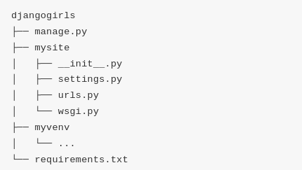
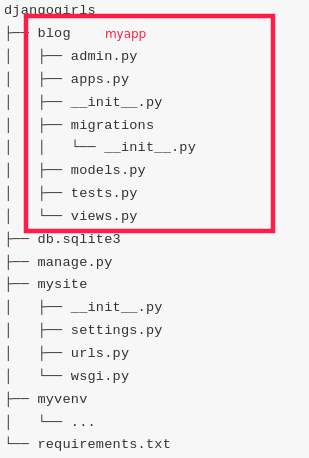

# Django, a web framework for Python

## What is Django

## Installation

### Prerequisites

#### - Virtual environnement

A `virtualenv` isolates Python and Django setup on a per-project basis. It allows to install different versions of a python lib without conflicts. It is not mandatory but wil save from a lot of trouble!

In the folder where the python project will settle, create a `myenv` (or whatever, given i must be lowercase and no spaces) virtualenv :

```bash
python3 -m venv myenv
```

Start the virtualenv `myenv` by typing :

```bash
source myenv/bin/activate
# or
. myenv/bin/activate
```

#### - Django installed

First, test and install `pip` in the __virtualenv__:

```bash
python -m pip install --upgrade pip
```

There is a file, `requirements.txt`, where lib dependencies are listed for `pip` to install. Create it and fill it with `Django~=2.2.4`

And run pip:

```bash
pip install -r requirements.txt
```

### Set up a Django project

This command will build the directories and files required to make a Django project:

```bash
django-admin startproject mywebsite .
```

The structure looks like this:



#### [manage.py](https://docs.djangoproject.com/en/2.2/ref/django-admin/)

this script for helping management of the site (like starting a web server). You can use either `python manage.py <cmd>` or `django_admin <cmd>`

Availaible commands|Use for
-|-
`check [app_label [app_label ...]]`| check for common problems inside the project
`compilemessages`| compiles .po files created by makemessages to .mo files for use with the built-in gettext support
`makemigrations [app_label [app_label ...]]`|Creates new migrations based on the changes detected to your models.
`migrate [app_label] [migration_name]`|Synchronizes the database state with the current set of models and migrations
`runserver [addrport]¶`|Starts a lightweight development Web server on the local machine. By default, the server runs on port 8000 on the IP address 127.0.0.1
`sendtestemail [email [email ...]]`|Sends a test email (to confirm email sending through Django is working) to the recipient(s) specified
`shell`|Starts the Python interactive interpreter
`showmigrations [app_label [app_label ...]]`|Shows all migrations in a project
`sqlflush`|Prints the SQL statements that would be executed for the flush command.
`sqlmigrate app_label migration_name`|Prints the SQL for the named migration. This requires an active database connection, which it will use to resolve constraint names; this means you must generate the SQL against a copy of the database you wish to later apply it on.
`sqlsequencereset app_label [app_label ...]`|Prints the SQL statements for resetting sequences for the given app name(s).
`squashmigrations app_label [start_migration_name] migration_name`|Squashes the migrations for app_label up to and including migration_name down into fewer migrations, if possible. The resulting squashed migrations can live alongside the unsquashed ones safely
`startapp name [directory]`|Creates a Django app directory structure for the given app name in the current directory or the given destination
`startproject name [directory]`|Creates a Django project directory structure for the given project name in the current directory or the given destination
`test [test_label [test_label ...]]`|Runs tests for all installed apps.
`testserver [fixture [fixture ...]]`|Runs a Django development server (as in runserver) using data from the given fixture(s), like `mydata.json`
`changepassword [<username>]`|*This command is only available if Django’s authentication system (django.contrib.auth) is installed
`createsuperuser`|*=This command is only available if Django’s authentication system (django.contrib.auth) is installed.
`remove_stale_contenttypes`|*.Deletes stale content types (from deleted models) in your database.
`clearsessions`|Can be run as a cron job or directly to clean out expired sessions

#### [settings.py](https://docs.djangoproject.com/en/2.2/ref/settings/)

Configuration for the project: TIME_ZONE, LANGUAGE_CODE, STATIC_URL, STATIC_ROOT, ALLOWED_HOSTS, DATABASES, INSTALLED_APP...

It can override `django/conf/global_settings.py`.

It can be used in code by importing objects:

```python
from django.conf import settings

    if settings.DEBUG:
        #...
```

Among the core settings, check these important ones:

settings|Use for
-|-
`ALLOWED_HOSTS`|A list of strings representing the host/domain names that this Django site can serve. This is a security measure to prevent HTTP Host header attacks
`CACHES`|A dictionary containing the settings for all caches to be used with Django. It is a nested dictionary whose contents maps cache aliases to a dictionary containing the options for an individual cache. Keys: BACKEND,LOCATION, TIMEOUT...
`DATABASES`|A dictionary containing the settings for all databases to be used with Django. It is a nested dictionary whose contents map a database alias to a dictionary containing the options for an individual database.Keys: `ENGINE` (like 'django.db.backends.postgresql'), `NAME`, `USER`, `PASSWORD`, `HOST`, `PORT`, `TEST`
`DATE_INPUT_FORMAT`|A list of formats that will be accepted when inputting data on a date field. Formats will be tried in order, using the first valid one (`'%Y-%m-%d', '%m/%d/%Y',`)
`DEBUG`|True or Flase. __Never deploy with DEBUG turned on__. When true, display detailed traceback on client. Also remenber all SQL query it executes.
`DEFAULT_CHARSET`|Default charset to use for all HttpResponse objects, if a MIME type isn’t manually specified
`DEFAULT_CONTENT_TYPE`|Default content type to use for all HttpResponse objects, if a MIME type isn’t manually specified
`INSTALLED_APPS`|A list of strings designating all applications that are enabled in this Django installation.
`MEDIA_ROOT`|Absolute filesystem path to the directory that will hold user-uploaded files.
`MIDDLEWARE`|[Middleware](https://docs.djangoproject.com/en/2.2/topics/http/middleware/) installed.
`SECRET_KEY`|A secret key for a particular Django installation. This is used to provide cryptographic signing, and should be set to a unique, unpredictable value.
`TEMPLATES`|A list containing the settings for all template engines to be used with Django. Each item of the list is a dictionary containing the options for an individual engine.
`STATIC_ROOT`|The absolute path to the directory where [collectstatic](https://docs.djangoproject.com/en/2.2/howto/static-files/) will collect static files for deployment.
`STATIC_URL`|URL to use when referring to static files located in STATIC_ROOT.

#### [urls.py](https://docs.djangoproject.com/en/2.2/topics/http/urls/)

Patterns for URL resolver. The __URLconf__ module (`ROOT_URLCONF` setting) is a mapping between URL path expressions to Python functions (views).

In the urlpatterns variables, the resolver pass through `path` or `re_path` instances sequence and once matched, the view get passed :

* an instance of HttpRequest
* kwargs of any named parts matched by the path expression

```python
urlpatterns = [
    path('articles/2003/', views.special_case_2003),
    path('article/<author>/',views.author_article,name="author")
    path('articles/<int:year>/', views.year_archive),
    path('articles/<int:year>/<int:month>/', views.month_archive),
    path('articles/<int:year>/<int:month>/<slug:slug>/', views.article_detail),
]
```

in brackets, values are captured to be sent with the request to the view. Any value will match `<author>` whereaswith a path converter `<int:year>` expects a integer to match. The view called would be `view.year_archive(request, year=val)`.

path converter|match
-|-
`str`|non empty string, `/` excluded
`int`|positive integer (0 inc.). returns int
`slug`|sequence of ASCII letters, numbers, hyphen or underscore
`uuid`|formatted UUID. Returns a UUID instance
`path`|non empty string, `/` included

If no path are matched, __Django__ invokes an error handling view. there are 4 default views for 400 (conditional error), 403 (rights restriction error), 404 (ressource not found), 500 (server error, like a runtime error in `view.py`).

```python

extra_patterns = [
    path('contact/',sales_views.contact),
    path('reports/<int:year>',sales_views.report),
]

urlpatterns = [
    path('',main_views.homepage),
    path('help',include('app.help.urls')),
    path('sales',include(extra_patterns)),
]
```

Here, `/sales/reports` will be handled by `sales_views.report()` view.

Extra options can be passed to views:

```python
from django.urls import path
from . import views

urlpatterns = [
    path('blog/<int:year>/', views.year_archive, {'foo': 'bar'}),
]
```

View will be called as `views.year_archive(request, year=xxxx, foo='bar')`.

To avoid hard-coding URLs (laborious, hard to maintain), it is best to _don't repeat yourself_, with a reverse resolution of URLs.
For that, you need to identify the view with a _name_, and the types (positional or keyword) and values of the view arguments:

URLconf:

```python
path('articles/<int:year>/', views.year_archive, name='news-year-archive')
```

Template:

```html
<a href="">2012 Archive</a>
{# Or with the year in a template context variable: #}
<ul>

<li><a href="">{{ yearvar }} Archive</a></li>

</ul>
```

#### Create an application

To create an application inside the project, run :

```bash
python manage.py startapp myapp
```

The structure of `myapp` is now :



The app is not available yet, it must be called by Django. In the project's `settings.py`, add :

```python
INSTALLED_APPS = [
    ...,
    'myapp.apps.MyappConfig
]
```

>[Projects and Applications](https://docs.djangoproject.com/en/2.2/ref/applications/)
>
>_Project_ describes a __Django__ web application. Creating a project means creating a python package with the name of the project.
>
>It includes settings, urls, and wsgi and often extended to include things like fixtures, CSS, templates which are not tied for a specific application.
>The project's root directory is _usually_ a container for all applications.
>The _application_ describes a python package that provides some set of features
>
>_Applications_ may be reused in various projects, see [Django packages](https://djangopackages.org/). They include models, views, templates, static files, URLS, middleware... They are wired into projects withe the INSTALLED_APPS setting.
>
>__Application__ is not an object, it is just a set of codes, but is configurable with a configuration class.

### Create a database

In the `DATABASES` entry, a sqlite database is configured like:

```python
DATABASES = {
    'default': {
        'ENGINE': 'django.db.backends.sqlite3',
        'NAME': os.path.join(BASE_DIR, 'db.sqlite3'),
    }
}
```

Other backends ara available [here](https://docs.djangoproject.com/en/2.2/ref/databases/#third-party-notes). _NoSql is not offically supported, but third parties packages are [available](https://djangopackages.org/grids/g/nosql/)_.

The `INSTALLED_APPS` contains apps that can require at least one table in a database.

default apps | for
-|-
django.contrib.admin | The admin site.
django.contrib.auth | An authentication system.
django.contrib.contenttypes | A framework for content types.
django.contrib.sessions | A session framework.
django.contrib.messages | A messaging framework.
django.contrib.staticfiles | A framework for managing static files.

To create the database use:

```bash
python manage.py migrate
```

the migrate commands looks at the INSTALLED_APPS settings and create necessary tables in DATABASE setup in settings.

### Run the web server

```bash
python manage.py runserver
```

The web site is accessible on localhost on port 8000: [http://localhost:8000](http://localhost:8000/)

## Django Models

In `myapp\models.py` file, all models objects (properties, methods) are defined. These objects will be saved in the `database`.
The models are classes, properties are type that can be stored in a DB, for example:

type|name
-|-
boolean|`booleanField(**options)`
string|`CharField(max_length,**options)`
date|`DateField(auto_now=False, auto_now_add=False, **options)`
date & time|`DateTimeField(auto_now=False, auto_now_add=False, **options)`
integer|`IntegerField(**options)`
decimal|`DecimalField(max_digits=None, decimal_places=None, **options)`
email|`EmailField(max_length=254, **options)`
file|`FileField(upload_to=None, max_length=100, **options)`
image|`ImageField(upload_to=None, height_field=None, width_field=None, max_length=100, **options)`
Foregin key relationship|`ForeignKey(to, on_delete, **options)`
...|...

These arguments are all optional:

option|type
-|-
null|boolean
blank|boolean
choices|sequence
db_column|name of the db column for the field
db_index|index to create
default|must be inmutable
primary_key|only one per column
validators|list of [validators](https://docs.djangoproject.com/en/2.2/ref/validators/)
...|...

Any model should have a `__str__(self)` method if it means to be displayed by the admin app.

As you change models in the `models.py` file, you must appply for these changes in the framework:

```bash
python manage.py makemigrations myapp
```

A migration file is created (in `mayapp/migrations/` folder), `/0001_initial.py` reflecting all changes to be made. Each app of the project relying on DB will have its migrate folder. The `sqlmigrate` command outputs a SQL statement reflecting these changes, according to each DB provider SQL specifications.

then the changes in the database are updated:

```bash
python manage.py migrate myapp # specific to the app
```

To let the admin app access the app's models, it must be register in admin.py:

```python
from django.contrib import admin
from .models import Post

admin.site.register(Post)
```

### ORM and querysets

Objects in database can be retrieved using methods from `QuerySet` class:

```python
Post.objects.all()  
Post.objects.first()
...

# create
Post.objects.create(**kwargs)
```

`filter` method takes as argument a field name and a operations/filter (lookups) separated by a double `_`:

```python
Post.objects.filter(author__username='admin')
Post.objects.filter(title__contains='post') # equals to SELECT * WHERE title LIKE %post%
Post.objects.filter(title__icontains='post') # case insensitive
Post.objects.filter(published_date__lte=datetime.now()) #
```

Here's the complete [list of lookups](https://docs.djangoproject.com/en/3.2/ref/models/querysets/#field-lookups)

Results can be ordered :

```python
Post.objects.order_by('created_date')
# or reverse
Post.objects.order_by('-created_date')
```

## Django admin

To log in the admin dashboard, you must create a superuser:

```bash
python manage.py createsuperuser
```

To manage objects from `models` in database (CRUD operations), add in `myapp/admin.py`:

```python
from .models import Post # the created object in models.py
```

## [Django routing](https://docs.djangoproject.com/en/2.2/topics/http/urls/)

Routing in Django are managed in `mysite/urls.py`:

```python
from django.urls import path,include

urlpatterns = [
    path('admin/', admin.site.urls),
    path('', include('myapp.urls')),
]
```

The homepage URL now is redirecting towards the `urls.py` file. It links the route with the views:

```python
from django.urls import path
from . import views # view file for myapp

urlpatterns = [
    path('', views.post_list, name='post_list')
]
```

with the `name` args, it is easier to manage urls. In template, for example a link to `post_list` will be :

```html
<a href="">{{ value }}</a>
```

To isolate same view name from different apps in the same project, use a namespacing URL name in `urls.py`:

```python
from . import views

app_name='blog`
urlpatterns= [
    #...
]
```

then the view template looks like:

```html
<a href="">{{ value }}</a>
```

## [Django views](https://docs.djangoproject.com/en/2.2/topics/http/urls/)

`Views` in __Django__ take a web request as input parameter and returns a [http response](https://docs.djangoproject.com/en/2.2/ref/request-response/#django.http.HttpResponse) or raises an exception.

The response can be either :

* HTML contents
* a redirect
* a 404 error
* XML document
* an image
* a PDF file
* generate a ZIP file
* ...

using any Python librairy.

```python
from django.http import HttpResponse
import datetime

def current_datetime(request):
    now = datetime.datetime.now()
    html = "<html><body>It is now %s.</body></html>" % now
    return HttpResponse(html)
```

or

```python
from django.shortcuts import render

def post_lit(request):
    return render(request, 'blog/post_list.html',{})
```

Here `render(request, template.html, context)` is the same as:

```python
HttpResponse(template.render(context,request))

# with
from django.template import loader
template = loader.get_template('template.html')
```

Views can be either function, or a [class](https://docs.djangoproject.com/en/2.2/topics/class-based-views/).

### [Django template](https://docs.djangoproject.com/en/2.2/topics/templates/#the-django-template-language)

type|Implementation
-|-
Variable|`{{ first_name }}` with `first_name` provided in a _context_ ({`first_name:'joe'}`) or `{{ list.0 }}`
[Filter](https://docs.djangoproject.com/en/2.2/ref/templates/builtins/#ref-templates-builtins-filters)|`{{ my_date|date:"Y-m-d" }}`
Comment|`{{# a comment #}}`
[Tags](https://docs.djangoproject.com/en/2.2/ref/templates/builtins/#ref-templates-builtins-tags)|``

## [Django forms](https://docs.djangoproject.com/en/2.2/topics/forms/)

Forms are created in `myapp/forms.py` file. They used `django.forms` and are associated to a model :

```python
from django import forms
from .models import Post

class PostForm(forms.ModelForm):

    # This class to tell the form which model and fields to be used
    class Meta:
        model = Post
        fields = ('title','text',)
```

In the `view.py`, first import the newly created form and use it in the view definition function:

```python
from .forms import PostForm
...
def post_new(request):
    if request.method == "POST": # int the template we submit the form using POST
        form = PostForm(request.POST)
        if form.is_valid(): # validator
            post = form.save(commit=False) # commit decides if changes are applied immediatly in the database
            post.author = request.user
            post.published_date = timezone.now()
            post.save() # commit to database
            return redirect('post_detail', pk=post.pk) # use redirect to display the post detail page
    else:
        form = PostForm()
    return render(request,'myapp/post_edit.html',{'form': form})
```

## Sources

[Django girls tutorial](https://tutorial.djangogirls.org/en/whats_next/)
