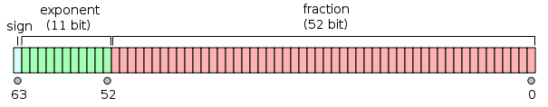

# Learn Python 3

__Python__ has been created by Guido Van Rossum in 1989. It is now is widely used, from programming learning to Machine Learning, from universities to GAFA back-end product.

__Python__ is a interpreted langage, that means that the source code ```.py``` is turned into byte code ```.pyc``` by the interpreter. Compare to a compiled language such as JAVA or C++, the program is not optimized for the hosting machine. The induced slowness may not be seen as a drawback, as nowadays enhanced hardware capacities are capable to speed up programs computing.

Faster interpreter (ex pyPy or Pandas, NumPy for DataScience) can be used instead.

|Main caracteristics|
|-|
|By design protability|
|Logical consistency|
|Productivity (the same program in JAVA could be 3 to 5x longer)|
|Extensive libraries|
|Software quality (readability)|
|Software integration (with other langages)|

> __Python Usages__:
>
> * Scripting
> * Functional programming
> * Imperative programming
> * Object Oriented
> __for__
>   * System programming
>   * web development
>   * GUI apps
>   * Gaming & Robotics
>   * Rapid prototyping
>   * System integration
>   * Data Science
>   * DB application

## Virtual Environment

Virtual environments is an encapsulation of the the interpreter and required libraries. Therefore 2 Python projects will use the version of each library, skipping potential version compatibilities.

To install a virtual env :

```bash
sudo apt-get install python-virtualenv

# Create the virtual env:
virtualenv -p $(which Python3.6) my_venv

# activate it:
source my_venv/

# desactivate:
desactivate
```

Newer way to create a virtualenv :

```bash
python -m venv my_venv
```

in the working directory.

## Scopes and Namespace

__Namespaces__ is a mapping from names to objects. For example, calling an object from a module uses namespace: `from carfactory.process import painting`
`painting` is a name of an object stored in the namespaces `process` in namespace `carfactory`

A __scope__ is a textual region of a Python program, where a namespaceis directly accessible.

When in a program, we refer to a nmae, __Python__ looks in these 4 scopes in __this__ order:

1. Local : the innermost space (inside a function or a loop for example)
2. Enclosed : the enclosing function just above
3. Global
4. Built-in : Python's standart function (like `print`)

## Build-in Data Types

```python
age=40
```

```age``` is obviously a ```int```. But as everything in __Python__, it is an object. Even Class are object (of type metaclass).
```age``` has an ```id```, a ```type``` and a ```value```.

If I change the _value_, I changed the _id_, i.e the variable points to another location in the memory.

If the value changes, the object is called __mutable__, if it cannot, it is __immutable__.

### Integers

Unlimited range (only to the available virtual memory)

|Operations||
|-|-|
|addition| a + b|
|substraction| a - b|
|multiplcation| a * b |
|true division (not truncated) | a / b|
|integer division| a // b|
|modulo| a % b|
|power| a ** b|

in _Python 3.6_, n = 1_024 = 1024

### Booleans

__Python__ evaluates every objects non empty to `True`, otherwise `False` (for str, tuples, lists...).

|Operations|result|
|-|-|
|True and False|True|
|True or False|True|
|not True|False|
|int(True)|1|
|int(False)|0|
|bool(-54)|True|
|bool(54)|True|
|bool(0)|False
|bool(0.0)|false
|3+True|4|

### Reals

eq. floating point numbers (IEEE 754 double-precision binary floating-point format) are stored in __Python__ only in 64 bits.



sign : 1 bit , +/-.
exponent : 11 bits = 2048 values; from -1022 to -1023.
significand precision : 52 bits => 2**-53 ~= 1.11*10**-16. 15 to 17 significant decimal digits.


> __Special representations__:
>
> 0 00000000000 00000000000000000000000000000000000000000000000000002 ≙ +0
>1 00000000000 00000000000000000000000000000000000000000000000000002 ≙ −0
>0 11111111111 00000000000000000000000000000000000000000000000000002 ≙ +∞ (positive infinity)
>1 11111111111 00000000000000000000000000000000000000000000000000002 ≙ −∞ (negative infinity)
>0 11111111111 00000000000000000000000000000000000000000000000000012 ≙ NaN (sNaN on most processors, such as x86 and ARM)
>0 11111111111 10000000000000000000000000000000000000000000000000012 ≙ NaN (qNaN on most processors, such as x86 and ARM)
>0 11111111111 11111111111111111111111111111111111111111111111111112 ≙ NaN (an alternative encoding of NaN)

IEE 754 suffers from precision even for small numbers : _0.3 - 0.1 * 3 <> 0_ !!

### Complex

```Python
c = 3.14 + 2.73j
c.real #=3.14
c.imag #=2.73
```

### Fractions

are imported from `Fraction` library :

```Python
Fraction(10,6) + Fraction (2,3) # = Fraction(7,3)
f = Fraction(10.6)
f.numerator # 5
f.denominator # 3
```

### Decimals

imported from `Decimal` library

```Python
Decimal(3.14)
```

will not be truncated (`Decimal(3.14000000000012345...`))

```Python
Decimal('3.14')
```

will have no approximations

Only way to make money calculations :

```Python
Decimal('0.1') * Decimal(3) - Decimal('0.3') # = Decimal('0.0')
```

### String

Strings are __immutable__ sequences of __Unicode code points__.

There is no `char` type in __Python__.

To store text information or to send data through the network, it is best to encode it as `bytes` objects.

built str|
-|
`'single quote'`|
`"double quote"`|
`''' triple quote if there are several lines of text'''`|

`ord('A')` to get the ASCII value of a letter.

To get the position of a substring, try:
`'abcde'.find('b',stop_opt)` returns -1 if not found whereas
`'abcd.index('b',stop_opt)` throws an error if not found.
To get the last occurence, `rindex(..)` and `rfind(..)`.

#### Indexing

`string` are immutable, their contents are indexable :

```Python
s[start:stop:step] # all are optional so
s[:] # is a copy of the original object
s[::-1] is a reversed copy
```

#### Formating

Different ways to write _Hello world!_:

implementation|call
-|-
`s = 'hello %s'`| `s % 'world'`
`s = hello {} {}`| `s.format('world','!')`
`s = hello {0} {1}`| `s.format('world','!')`
`s = hello {name} {pt}`| `s.format(name='world',pt='!')`

### Bytes

from a string, use `encode('utf-8')` to change into bytes :

```Python
str='a string'
s_encoded = str.encode('utf-8')
s_decode = s_encoded('utf-8')
# and
b_object = b"this_is_bytes_object" # with only ASCII characters
```

### Tuples

Tuples are __immutable__, and accept various types of objects. They allows patterns that are hard to reproduce in others languages.
Retrieved by indexing

creation|implementation
-|-
empty tuple | `t = ()`
one element tuple | `t = (42,)`
several elements tuple | `t = (1,2,3)`
multi assignment | `a, b, c = 1, 2, 3`
membership test | `3 in t`
one-line swap | `a, b = b, a`

#### namedtuple

In addition of index, the `namedtuple` collection allows to specify a name to each attribute
Allow the code to be more readeable, also avoid to refactor an existing tuple worrying about attibute order.

```Python
from collections import namedtuple
Kids = namedtuple('Kids',['elder'])
mykids = Kids('Joachim')
mykids[0] # eq to mykids.elder 'Joachim'


Kids = namedtuple('Kids',['elder','younger'])
mykids = Kids('Joachim','Timothée')
mykids[1] # == 'Timothée'
```

### Lists

Lists are __mutable__, and are commonly used to store __homogeneous__ objects.
Retrieved by iteration.

creation|implementation
-|-
empty list | `l = ()` or `l = list()`
several elements list | `l = [1, 2, 3]`
list from a tuple | `l = list([a, b, c])`
list from string | `l = list('hello)` => `['h','e','l','l','o']`

operation|implementation
-|-
append a list| `l.append(4)`
count an occurence | `l.count(1)`
extend a list by another one | `l.extend([5,6])` or `l+[5,6]`
get first position | `l.index(2)`
get last position | `l.rindex(2)`
insert at a position | `l.insert(0,-1)`
remove last element | `l.pop()`
remove a specific element by its index | `l.pop(3)`
remove a specific element | `l.remove(3)`
reverse the order of the list | `l.reverse()`
sort the list | `l.sort()`
remove all elements | `l.clear()`
length | `len(l)`
sum | `sum(l)`
min | `min(l)`
max | `max(l)`

> #### sorting algorithm
>
> ```Python
> from operations import itemgetter
> a = [(5, 3), (1, 3), (1, 2), (2, -1), (4, 9)]
> ```
>
> the sorted function preserves the original order :
>
> ```Python
> sorted(a,key=itemgetter(0))
> >>> [(1, 3), (1, 2), (2, -1), (4, 9), (5, 3)]
> ```
>
> sort and reverse  in one line:
>
> ```Python
> sorted(a,key=itemgetter(1), reverse=True)
> >>> [(4, 9), (5, 3), (1, 3), (1, 2), (2, -1)]

### Bytearrays

They represents the mutable version of `bytes` objects. When receiving data through a socket, they elimintaes the need to concatenate datat while polling.
It allows all the usual methods of mutable sequences as well as most of the methods of the `bytes` type.

creation|implementation
-|-
empty bytearray | `bytearray()`
zero filled bytearray | `bytearray(10)`
bytearray from bytes | `name = bytearray(b'hello')`

### Sets and frozensets

These are unordered collections of __hashable__ objects. `frozenset` is immutable whereas `set` is mutable type.

> __Hashability__:
> an hashable object has a never changing hash value. Hence, they can be compared to other objects. Equal objects has the same hash value. All immutable built-in object are hashable.
> `Set` and `Dictionnary` keys are hasahable because it is their hash value is stored internally.

__Hashability in action__ :

```Python
small_primes = {2, 3, 5}
small_primes.add(3) # 3 already included
small_primes
>>> {2, 3, 5}

bigger_primes = {5, 7, 11}
small_primes & bigger_primes
>>> {5}
```

operation|implementation
-|-
create a set | `set()` or `set([2, 3, 5])` or `s = {2, 3, 5}`
add an object | `s.add(7)`
remove an object | `s.remove(7)`
union of 2 sets | `set_a | set_b`
intersection of two sets | `set_a & set_b`
difference of two sets | `set_a - set_b`

`frozenset` cannot call `add` or `remove` because of it __immutability__

### Dictionnary

__Dictionnaries__ are the only mapping type in standard __Python__.

operation|implementation
-|-
create a dictionnary|`d=dict(A=1,Z=e)` or `{'A':1,'Z'='e'}` or `dict(zip['A','Z'],[1,'e'])`*
add an object|`d['A']=32`
remove an object|`del d['A']`

The membership test is checked against the keys not the values :  

```Python
A in d # True
1 in d # False
```

To iterate over members, either use :

```Python
d.items() # (keys,values) pairs in the dictionary
d.keys()
d.values()
```

Specific functions for dictionnaries :

operation|implementation
-|-
get an item or __None__|`d.get('A')`
get an item or a defaut value if None|`d.get('B',44)`
get an item or a defaut value if None _and set it accordingly in the dict_|`d.setdefault('B',21)`
remove an item|`d.pop('A')`*
update a value|`d.update(A=1)` or `d.update({'A':1})`
\* if key doesn't exist, it returns a  `KeyError` error unless adding a default value to the function (`d.pop('A',0)`).

#### defaultdict

Another useful collection, it allows to get any dictionnary items with default value without to test if the key is present:

```Python
from collections import defaultdict
dd = defaultdict(int) # all default values are 0
dd['age'] += 1
>>> {'age': 1}
```

### ChainMap

It behaves like as dictionnary but deal with multiple mappings between dictionnaries. It is usually much faster than dictionnary.

1. create the containing dictionnaries and the ChainMap:

```Python
from collections import ChainMap
default_dic = {'A':1,'B':2}
dic = {'A':42}
d_map = ChainMap(dic, default_dic)
```

2. Get an item (search in first mapping)

```Python
d_map['A']
>>> 42
d_map['B']
>>> 2
```

3. Add/delete  an item (only in first)

```Python
d_map['C'] = 33
d_map.maps
>>> [{'A':42,'C':33},{'A': 1, 'B': 2}]
del d_map['C']
>>> [{'A':42},{'A': 1, 'B': 2}]
```

4. merge and convert into regular dictionnary

```Python
dict(d_map)
>>> {'A': 42, 'B': 2, 'C': 33}
```

### Summary

Caracteristics\Type|string|tuple|list|set|frozenset|dictionnary|
-|-|-|-|-|-|-|
Notation|`a=''`|`t=()`|`l=[]`|`s={}`|`fs=frozenset()`|`d={}`|
Python version|1.0|||||3.6|
Mutable|Immutable|Immutable|Mutable|Mutable|Immutable|Mutable|
Hashable|No|No|No|Yes|Yes|Yes (keys)|
Ordered|Yes|Yes|Yes|Yes|Yes|Yes (>Python 3.6)|
Creation|`a='hello'`|`t=('h',3,'l','l','0')`|`l=list('hello')` or `l=[1,2,3]`|`s={1,2,3}` or `s=set([1,2,3])`|`fs=frozenset([1,2,3])`|`d={'A':1,'B':2}` or `d=dict([('A',1),('B',2)])`|
Add|-|-|`l.append(4)` or `l.extent([4,5])` or `l.insert(0,-1)`|`s.add(7)`|-|`d['C']=4`|
Remove|-|-|`l.pop(index_opt)` or `l.remove(obj)` or `l.clear()`|`s.remove(7)`|-|`del d['C']` or `d.clear()` or `d.popitem(key_opt)`|
Include test| `'l' in a`|`'l' in t`|`'l' in l`|`4 in s`|`4 in fs`|`key in d`|
basic functions|||max(),min(),len(),sort(),reverse()|Union `|`, Intersection `&`, difference `-`||`d.keys()`, `d.items()`, `d.values()`, `d.get(key,default_opt)`, `d.update(D=5)`, `d.setdefault(key,default_val)`|

## Iteration and conditional programming

### `if`

```Python
if a_test:
    print('something')
elif a_val == 'somteting else':
    print('something else')
else:
    print('another')
```

> Ternary operator
>  
> ```Python
> a_val = 666 if b > 100 else 0`
> ```
>  

### loop

Use loop on every iterable object (tuple, list, dict, file objects...). It can be any object from classes with an `__iter__()` or `__getitem()__` like:

#### `for`

```Python
for number in [1,2,3,4]:
    print(number)

numbers = [1, 2, 3, 4]
letters = ['A','B','C','D']
for number in numbers:
...
for position, number in enumerate(numbers):
...
for number, letter in zip(numbers,letters):
...
```

Use `else:` at end of a loop if the latter is not 'break'

```Python
people = [('James', 17), ('Kirk', 9), ('Lars', 13), ('Robert', 8)]
for person, age in people:
    if age >= 18:
        driver = (person, age)
        break
else:
    raise DriverException('Driver not found.')
```

#### `while`

```Python
while n > 0:
    print(n)
    n -=1
    if True:
        break
        # or
        continue
```

> `itertools` module
> [See Python 3.9 doc](https://docs.python.org/3/library/itertools.html)
> make available several __iterators__ with specific behaviors:
>  
> * Infinite iterator (like `count()` or `cycle()`)
> * Iterators terminating on the shortest input sequence (`compress(iterator_1,iterator_2)`,`zip_longuest(l_1,l_2,fillvalue('-')`)
> * Combinatoric iterators (`permutation('seq')`)

#### Iterables and iterators

##### `map`

`map(function,*iterable)` returns a iterator object that applies a function to every item of _iterable_ arg. With several _iterable_ objects, the iterator stops at the shortests of the iterable.
For example:

```python
# this flambda function transform any input arguments (items of all iterators at the same position) in a tuple
to_list = lambda *a : a

# map each item of incoming lists to each other
list(map(to_list,range(3),'abcd'))
>>> [(1,'a'),(2,'b'),(3,'c')] # d not out as output is 3-length long.

# concatenate the items of the tuple a
join_together = lambda *a : ''.join(a)
list(map(join_together,'abc','zyx'))
>>> ['za','yb','cx']
```

##### `zip`

`zip(*iterables)` make an iterator that aggregates elements from each of the iterables.

```python
grades = [18, 23, 30, 27]
avgs = [22, 21, 29, 24]
list(zip(avgs, grades))
>>> [(22, 18), (21, 23), (29, 30), (24, 27)]
```

##### filter

`filter(function,iterable)` construct an iterator from the elements of the iterable for which the function returns `True`.
Iterable can be either a sequence, a container which support iteration, or an iterator.
If function is `None`, all the elements returning `False` (like 0) are removed.

```python
test = [2, 5, 8, 0, 0, 1, 0]
list(filter(lambda x: x > 4, test))  # keep only items > 4
>>> [5, 8]
list(filter(None,test))
>>> [2,5,8,1]
```

## Functions

### Implementing a function

```Python
# basic implementation
def my_function():
    # code here
    return # my_function returns None if collected (a=my_function()). eq to no return statement
# with input parameters
```

### Scope in a function - `nonlocal` and `global`

`nonlocal` binds objects to the nearest enclosing scope _excluding_ global scope.

```Python
# function in a function with scope (LEGB)
def outer():
    variable = 'outer'
    def inner():
        variable = 'inner'
        print(variable)
    inner()
    print(variable)

# call the method
variable = 'global_var'
outer()
print(variable)
>>> inner
>>> outer
>>> global_var

####################

# non local variable
def outer():
    variable = 'outer'
    def inner():
        nonlocal variable
        variable = 'inner'
        print(variable)
    inner()
    print(variable)

# call the method
variable= 'global_var'
outer()
print(variable)
>>> inner
>>> inner
>>> global_var

###################

# global variable
def outer():
    variable = 'outer'
    def inner():
        global variable
        variable = 'inner'
        print(variable)
    inner()
    print(variable)

# call the method
variable= 'global_var'
outer()
print(variable)
>>> inner
>>> outer
>>> inner
```

### Input parameters

#### Default values

Default values must be defined __after__ any positional argument. `func(a=11,b,c=33)` raises an error, do `func(b,a=11,c=33)` instead.

```Python
def func(a,b,c=33):
    print(b,c,a)

func(1,2,3)
>>> 1,2,3

func(22)
>>> error

func(11,b=22)
>>> 11,22,33
```

#### Variable arguments

##### Positional

A function can accept a variable number of arguments, with `*`:

```Python
def func(*args):
    type(args) # a tuple

func(1,2,3)
# eq 
func(*(1,2,3)) # unpacking
func((1,2,3)) # the tuple as one argument
func('A','B')
...
```

##### Keyword

A function can accept a variable number of arguments with keyword, with `**`:

```Python
def func(**kwargs):
    type(kwargs) # a dictionary

func(a=1,b=2)
# eq
func(**{'a'=1,'b'=2})
...
```

Example with default values:

```Python
def connect(**options):
    conn_params = {
        'host': options.get('host', '127.0.0.1'),
        'port': options.get('port', 5432),
        'user': options.get('user', ''),
        'pwd': options.get('pwd', ''),
    }
    print(conn_params)
    # we then connect to the db (commented out)
    # db.connect(**conn_params)

connect()
connect(host='127.0.0.42', port=5433)
connect(port=5431, user='fab', pwd='gandalf')
```

> keyword only argument
> `def func(*a,c):` c _must_ be explicitly called in the function call, other wise it throws an error
> `func(1,2,c=4)` ok
> `func(1,2,4)` nok

#### Combining input parameters

When defing a function, order must respect:

1. normal positionnal args (name)
2. default args (name=value)
3. variable positional args (\*name or \*)
4. keyword-only args (name or name=value)
5. variable keyword args (**name)

Unpacking with Python 3.5:

```Python
def additional(*args, **kwargs):
    print(args)
    print(kwargs)

args1 = (1, 2, 3)
args2 = [4, 5]
kwargs1 = dict(option1=10, option2=20)
kwargs2 = {'option3': 30}
additional(*args1, *args2, **kwargs1, **kwargs2)
```

### Return values

```Python
def func(a,b):
    return # empty, a when a=func() is None
    # or
    return a_val # unique
    # or
    return (a,b) # tuple
    # eq
    return a,b
```

### Lambda functions

When a quick, simple one-liner function is needed:

```Python
adder = lambda a,b: a+b
# eq
def adder(a,b):
    return a+b
```

### `import`

```Python
├── func_from.py
├── func_import.py
├── lib
    ├── funcdef.py
    └── __init__.py

# funcdef.py
def square(n): 
    return n ** 2 
def cube(n): 
    return n ** 3 

# func_import.py
import lib.funcdef 
print(lib.funcdef.square(10)) 
print(lib.funcdef.cube(10)) 

# func_from.py
from lib.funcdef import square, cube 
print(square(10)) 
print(cube(10))

# can also be relative imports
from .funcdef import (
    square,
    cube
)
```

