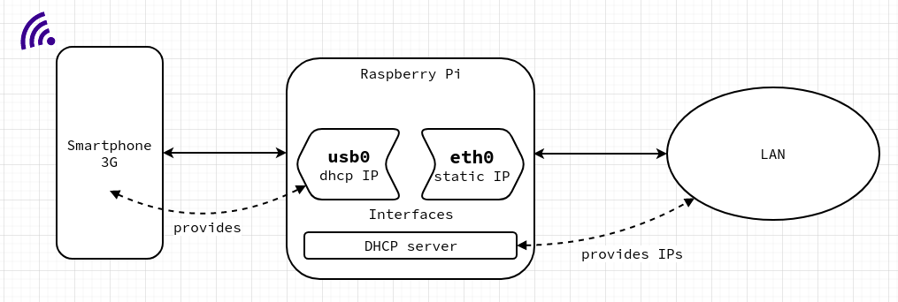

# 3G router with a Raspberry

With a Raspberry and a smartphone, it is possible to create a router for your LAN. The Raspberry pi acts as a router with 2 interfaces defined, an USB interface towards the smartphone (and the internet), and an Ethernet interface to the LAN.
To make it work, some packages and configuration are required on the Raspberry pi.

## Hardware Requirements

1. A Raspberry pi (any model should be ok, though I used a 3B version)
2. A smartphone with 3G/4G access and network sharing option activated (tethering)
3. (Optional) an access to the Raspberry pi to configure (direct or via SSH). See [Bonus](#bonus) for headless boot.

## Alpine Linux

In this tutorial, I used an image of the _Alpine Linux_ distribution. It is a very lightweight linux distr. that can run in a diskless mode (no disk mount, only use RAM).

[Download](https ://www.alpinelinux.org/downloads/) the Raspberry pi image archive (_aarch64_ for any Raspberry newer than the 2 model should work).

To install on the SD card, follow these instructions : https ://wiki.alpinelinux.org/wiki/Raspberry_Pi

After powering on, run `setup-alpine` and leave anything default.

To install packages, add offical repositories, in `/etc/apk/repositories` :

```bash
http ://dl-cdn.alpinelinux.org/alpine/v3.14/main
http ://dl-cdn.alpinelinux.org/alpine/v3.14/community
```

Then update the packages if necessary :

`apk upgrade` and `apk update`

With the __diskless__ mode, any changes in files must be commited before rebooting :

```bash
lbu ci
```

## Overview



## Installation

### Interfaces

In `/etc/network/interface`, define the interfaces :

```bash
auto usb0
allow-hotplug
iface usb0 inet dhcp

auto eth0
iface eth0 inet static
address 192.168.2.254/24
```

### DHCP server

Install package __isc-dhcp-server__. On Alpine Linux, run

```bash
apk add dhcp-server-vanilla
```

> For Debian-like distro : n `/etc/default/isc-dhcp-server`, add `INTERFACES="eth0"`

To configure the server, create a conf file `/etc/dhcp/dhcp.conf` :

```bash
default-lease-time 600;
max-lease-time 7200;

authoritative;

log-facility local7;

subnet 192.168.2.0 netmask 255.255.255.0 {
    range 192.168.2.50 192.168.2.250;
    option routers 192.168.2.254;
    option broadcast-address 192.168.2.255;
    option domain-name "yourdomain.local";
    option dns 80.67.169.12;
    interface eth0;
}
```

Change `yourdomain.local` with your own.
This DNS IP is google-free, avoiding legal restrictions.

On Alpine Linux, don't forget to add the server at startup :

```bash
rc-update add dhcpd
```

### NAT

To let LAN devices get access to internet, we need to configure NAT

Install package __iptables-persistant__. On Alpine Linux run

```bash
apk add iptables
```

>Debian-like ditros. :
>Either launch this command :
>
>`echo 1 > /proc/sys/net/ipv4/ip_forward`
>
>or
>
>in `/etc/sysctl.conf`, uncomment `net.ipv4.ip_forward=1`

For Alpine Linux, it can be done also with this command :

```bash
sysctl -w net.ipv4.ip_forward=1
```

```bash
iptables -F
iptables -t nat -F

iptables -t nat -A POSTROUTING -o usb0 -j MASQUERADE
iptables -A FORWARD -i usb0 -m state --state RELATED,ESTABLISHED -j ACCEPT
iptables -A FORWARD -i eth0 -o usb0 -j ACCEPT
```

> On Raspian, to give persistancy to the routing rule, run :
>
>```bash
>iptables-save > /etc/iptables/rules.v4
>```

On Alpine Linux, add iptables at startup and save the rules :

```bash
rc-update add iptables 

/etc/init.d/iptables save
```

>Don't forget to restart the network service :
>
>```bash
> systemctl restart networking
>```

On Alpine Linux :

```bash
/etc/init.d/networking restart
# or
rc-service networking restart
```

## Sources

https://www.g7smy.co.uk/2014/08/Raspberry-pi-as-a-3g4g-router/

https://wiki.alpinelinux.org/wiki/Alpine_newbie_apk_packages#Network_configuration

https://wiki.alpinelinux.org/wiki/Configure_Networking#Firewalling_with_iptables_and_ip6tables

Thx to Ad. for your tips!

## Bonus

In __headless mode__, configuration can be uploaded on the card with the Alpine image.
That means __no__ further modifications are necessary after the initial booting.

Instructions [here](https://wiki.alpinelinux.org/wiki/Raspberry_Pi_-_Headless_Installation) are quite straightforward :

1. After formatting the device, download and uncompress Alpine Linux version _x.y_ on the SD card,
2. Download and uncompress the [headless overlay file archive](https://github.com/davidmytton/alpine-linux-headless-Raspberrypi/releases/download/2021.06.23/headless.apkovl.tar.gz) and overwrite the file `/etc/local.d/headless.start` (don't forget to change the version number in the repository addresses),
3. Re-compress and copy the archive to the root directory of the SD card (script bellow),
4. Insert the card in the Raspberry pi, and before booting, establish a connection between the Raspberry and the computer RJ45 plugs. Connect the phone to an USB port and as the Raspberry is booting, enable USB network sharing on the smartphone settings. __This is the tricky part, the USB interface must be UP before the overlay script is launched__. Don't worry though, there is enough time.
5. As soon as the ethernet connection is on on the computer, try to connect to the Raspberry via ssh, `ssh root@192.168.2.254`, and run _alpine-setup_ as promoted (OPTIONAL).

```bash
#!user/bin/bash
# compress and copy headless folder to the card
sudo mount -v /dev/mmcblk0p1 /mnt/alpine/
tar czvf headless.apkovl.tar.gz etc/
cd /mnt/alpine/
cp ~/Documents/Alpine/headless.apkovl.tar.gz .
cd ~/Documents/Alpine/
sudo umount /mnt/alpine/
```

```bash
#!/bin/sh
# headless.start

__add_repositories()
{
	cat <<-EOF >> /etc/apk/repositories
	http ://dl-cdn.alpinelinux.org/alpine/v3.14/main
	http ://dl-cdn.alpinelinux.org/alpine/v3.14/community
	EOF
}

__create_eni()
{
	cat <<-EOF > /etc/network/interfaces
	auto lo
	iface lo inet loopback

	auto usb0
	allow-hotplug
	iface usb0 inet dhcp

	auto eth0
	iface eth0 inet static
		address 192.168.2.254/24
	    hostname routerpi
	EOF
}

__edit_ess()
{
	cat <<-EOF >> /etc/ssh/sshd_config
	PermitEmptyPasswords yes
	PermitRootLogin yes
	EOF
}

__edit_dhcpconf()
{
	cat <<-EOF > /etc/dhcp/dhcpd.conf
	default-lease-time 600;
	max-lease-time 7200;

	authoritative;

	log-facility local7;

	subnet 192.168.2.0 netmask 255.255.255.0 {
    	range 192.168.2.50 192.168.2.250;
    	option routers 192.168.2.254;
    	option broadcast-address 192.168.2.255;
    	option domain-name "yourdomain.local";
    	option domain-name-servers 80.67.169.12;
    	interface eth0;
	}
	EOF
}

__create_eni
rc-service networking start

__add_repositories
apk upgrade
apk update

apk add dhcp-server-vanilla

__edit_dhcpconf
rc-update add dhcpd

rc-service dhcpd start

apk add iptables
sysctl -w net.ipv4.ip_forward=1

iptables -F
iptables -t nat -F

iptables -t nat -A POSTROUTING -o usb0 -j MASQUERADE
iptables -A FORWARD -i usb0 -m state --state RELATED,ESTABLISHED -j ACCEPT
iptables -A FORWARD -i eth0 -o usb0 -j ACCEPT

rc-update add iptables 

/etc/init.d/iptables save

rc-service networking restart

/sbin/setup-sshd -c openssh
cp /etc/ssh/sshd_config /etc/ssh/sshd_config.orig
__edit_ess
rc-service sshd restart
mv /etc/ssh/sshd_config.orig /etc/ssh/sshd_config
```
