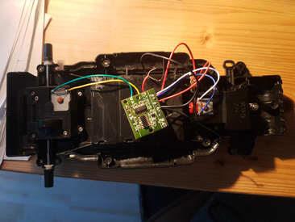
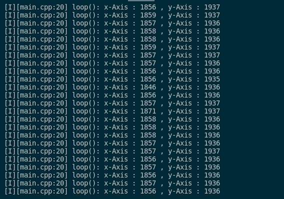
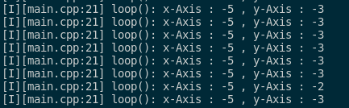

# Bluetooth controlled car from a dumped RC car
Recently I bought a 5€ worth car in a toy shop for my son. Ultimately it should have been a 1/10 or 1/8 RC car, but for unknown reason, the car mounting was unfinished : no battery plugs, no remote control. I thought it can be fun to finish that work.
Inside the car, there is a circuit board and 2 DC motors. The board barely discloses any information. It accepts 4.5V as input, has a 2.4 Ghz RF chip and that's it.
Instead, I'd install a MCU with a bluetooth receiver and a L293D chip to control the 2 motors. The controller also contains a bluetooth MCU, two 4-directionnal joysticks and a switch.



> Steps
>  
> 1. Make the controller and the joysticks operationals
> 2. Connect and transfer data between two bluetooth chips
> 3. Set up the L293D module and make the motors responsive
> 4. Final configurations and evolutions

## Tools and hardware

For the controller:

* 1 ESP32 MCU
* 2 4-direction joystick
* 1 switch
* 1 MT3608 Step-up converter
* 1 3.7V Li-ion battery

For the car :

* 1 ESP32 MCU
* 1 L293D
* 1 LM2596S Step-down converter
* 1 3.7V Li-ion battery
* 1 9V alcaline battery

## The controller

The joystick has 2 potentiometers acting as X and Y axis values sensors and one button acting as a third dimension.
A __3.3V__ input runs through the potentiometers. 2 analogic values can be read directly by the ESP32 [0,3.3]V.

schema here

```arduino
#include <Arduino.h>

const int xAxisGPIO = 13;
const int yAxisGPIO = 12;

int xInput = 0;
int yInput = 0;

void setup() {
  pinMode(xAxisGPIO,INPUT);
  pinMode(yAxisGPIO,INPUT);

  Serial.begin(115200);
}

void loop() {
  xInput = analogRead(xAxisGPIO);
  yInput = analogRead(yAxisGPIO);

  log_i("x-Axis : %d , y-Axis : %d",xInput,yInput);
  delay(2000);
}
```

According to this code, the serial output displays values read from the ADC inputs. When the joystick is centered, the values are :



> 2 findings :
>  
> * the joystick is not accurate, values fluctuates (slightly) even when joystick is idle
> * on a 12 bits ADC values, the range is [0-4095], and values at joystick center should be [2048,2048]. Actually, these values can fluctuate depending on surroundings equipements, breadboard layout... Values like [1860,1940] or [1798,1473] are observed.

No needs to send that precision to the motors, a 4 bits range is largely enough.
That means that a test calibration should be ran e
With a mapping function, we grossly get an appropriate range :

```arduino
X_to_convert= map((xInput-1860),-1860,2235,0,15);
Y_to_convert = map((yInput-1940),-1940,2155,0,15);
```

Center values are still not null, but stops changing :



Each step of the loop, the controller will send a byte compound of two 4-bits values. The X value is left-shifted by 4 to fill up the entire byte. The receiver can translate back this byte in 2 integer values in the [0,15] range.

For example :

xOutput = 00 -> `0000` , yOutput = 8 -> `1000` : xyOutput = `00001000` (8)
xOutput = 13 -> `1101` , yOutput = 4 -> `0100` : xyOutput = `11010100` (212)
xOutput = 07 -> `0111` , yOutput = 7 -> `0111` : xyOutput = `01110111` (119) _centered joystick position_

To avoid sending redundant data, a control is made that checks if any dimension sensor has changed:

```arduino
if ((yOutput != last_yOutput) || (xOutput != last_xOutput)) {
    ...
  }
```

### Bluetooth Implementation

The arduino library `BluetoothSerial` can send and receive data with associated pair with Bluetooth Classic. This is the one I'm going to use. Bluetooth BLE is another specification and beside its very low consumption (BLE means Bluetooth Low Energy), it is mainly used with small equipments sending short and discontinued data through the protocol. [This article [french]](https://tutos-gameserver.fr/2019/10/15/esp32-bluetooth-low-energy-ble-sur-arduino-ide-serveur-dimpression/) compares the two specifications with ESP32 examples.

The data is sent through a serial stream.
Firstly, the controller should be the _master_, the device sending data to the _slave_ (the car).
To allow a seamless pairing, the car MAC address (or the device name, though it takes longer to pair) is required :

```arduino
uint8_t carAdress[6] = {0xAC,0x67,0xB2,0x2B,0x27,0xF6};
...
bool connected = SerialBT.connect(carAdress);
```

Here is the complete code :

```arduino
#include <Arduino.h>
#include <BluetoothSerial.h>

const int xAxisGPIO = 13;
const int yAxisGPIO = 12;

byte xyOutput;
byte xOutput, yOutput, last_xOutput, last_yOutput = 0;
int xInput, yInput = 0;

BluetoothSerial SerialBT;
uint8_t carAdress[6] = {0xAC,0x67,0xB2,0x2B,0x27,0xF6};

void setup() {
  pinMode(xAxisGPIO,INPUT);
  pinMode(yAxisGPIO,INPUT);

  Serial.begin(115200);
  SerialBT.begin("BTController_1",true);
  SerialBT.setPin("1234");

  bool connected = SerialBT.connect(carAdress);

  if (connected) {
    log_i("Connected succesfully");
  } else {
    while(!SerialBT.connected(5000)) {
      Serial.println("Failed to connect. Make sure remote device is available and in range, then restart app.");
    }
  }
}

void loop() {
  xInput = analogRead(xAxisGPIO);
  yInput = analogRead(yAxisGPIO);
  log_i("raw x-Axis : %d , raw y-Axis : %d",xInput,yInput);

  xOutput = byte(map((xInput-1860),-1860,2235,0,15));
  yOutput = byte(map((yInput-1940),-1940,2155,0,15));
  log_i("xInput (byte) : %d , yInput (byte) : %d",xOutput,yOutput);
  
  if ((yOutput != last_yOutput) || (xOutput != last_xOutput)) {
    xyOutput = (yOutput << 4) | xOutput;
    SerialBT.write(xyOutput);

    last_xOutput = xOutput;
    last_yOutput = yOutput;
  }
  delay(500);
}
```

## The car

With only ESP32 in hands at the moment, the receiver will be identical to the controller.
Reciving and parsing incoming data from Bluetooth is quite straightforward, I end up with 2 half-`byte` variables, `forthBack` and `leftRight`:

value|translation
-|-
0| full speed backward
1-6|progressive backward
7|stop
8-14|progressive forward
15|full speed forward
_forthBack_

Value|Translation
-|-
0|full left
1-6|left
7|straight
8-14|right
15|full right
_leftRight_

