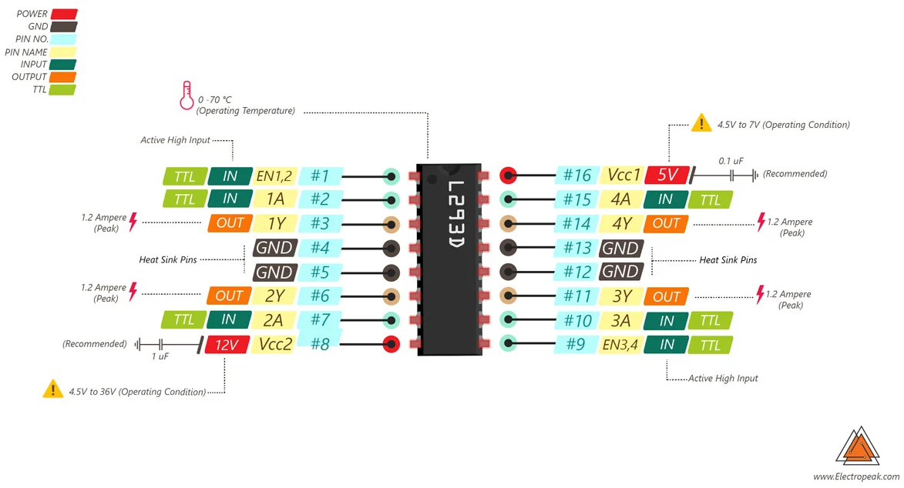

# Bluetooth controlled car from a dumped RC car

Recently I bought a 5€ worth car in a toy shop for my son. Ultimately it should have been a 1/10 or 1/8 RC car, but for unknown reason, the car mounting was unfinished : no battery plugs, no remote control. I thought it can be fun to finish that work.
Inside the car, there is a circuit board and 2 DC motors. The board barely discloses any information. It accepts 4.5V as input, has a 2.4 Ghz RF chip and that's it.
Instead, I'd install a MCU with a bluetooth receiver and a L293D chip to control the 2 motors. The controller also contains a bluetooth MCU, two 4-directionnal joysticks and a switch.


> Steps
>  
> 1. Make the controller and the joysticks operationals
> 2. Connect and transfer data between two bluetooth chips
> 3. Set up the L293D module and control the motors
> 4. Final configurations and evolutions

## Tools and hardware

For the controller:

* 1 ESP32 MCU
* 1 4-direction joystick
* 1 switch
* 1 MT3608 Step-up converter
* 1 3.7V Li-ion battery

For the car :

* 1 ESP32 MCU
* 1 L293D
* 1 LM2596S Step-down converter
* 1 3.7V Li-ion battery
* 1 9V alcaline battery

## The controller

### Calibrating the potentiometers

The joystick has 2 potentiometers acting as X and Y axis values sensors and one button acting as a third dimension.
A __3.3V__ input runs through the potentiometers. 2 analogic values can be read directly by any ADC pin of the ESP32 [0-3.3]V.


```arduino
#include <Arduino.h>

const int xAxisGPIO = 13;
const int yAxisGPIO = 12;

int xInput = 0;
int yInput = 0;

void setup() {
  pinMode(xAxisGPIO,INPUT);
  pinMode(yAxisGPIO,INPUT);

  Serial.begin(115200);
}

void loop() {
  xInput = analogRead(xAxisGPIO);
  yInput = analogRead(yAxisGPIO);

  log_i("x-Axis : %d , y-Axis : %d",xInput,yInput);
  delay(2000);
}
```

outputs of this code displays values read from the ADC inputs. When the joystick is centered, the values are :


> 2 findings :
>  
> * the joystick is not accurate, values fluctuates (slightly) even when joystick is idle
> * on a 12 bits ADC values, the range is [0-4095], so values at joystick center should be [2048,2048]. Actually, these values can fluctuate depending on surroundings equipements, breadboard layout... Values like [1860,1940] or [1798,1473] are observed.

That means that a test calibration should be ran each time the controller starts :

```arduino
int xCal_tmp = 2048;
int yCal_tmp = 2048;
for(int i = 0;i<10;i++) {
  xCal_tmp = analogRead(xAxisGPIO);
  yCal_tmp = analogRead(yAxisGPIO);
  if (xCenter_max < xCal_tmp) {
    xCenter_max = xCal_tmp;
  }
  if (xCenter_min > xCal_tmp) {
    xCenter_min = xCal_tmp;
  }
  if (yCenter_max < yCal_tmp) {
    yCenter_max = yCal_tmp;
  }
  if (yCenter_min > yCal_tmp) {
    yCenter_min = yCal_tmp;
  }
  delay(50);
}
```

The result is 2 _center_ ranges [`xCenter_min`,`xCenter_max`] and [`yCenter_min`,`yCenter_max`].

### Compute values to send

There is no need to send 12-bits values to the motors, a 4-bits (16 values) is enough.

Each step of the loop, the controller will send a byte compound of two 4-bits values. The X value is left-shifted by 4 to fill up the entire byte. The receiver can translate back this byte in 2 integer values in the [0,15] range.

For example :

xOutput = 00 -> `0000` , yOutput = 8 -> `1000` : xyOutput = `00001000` (8)

xOutput = 13 -> `1101` , yOutput = 4 -> `0100` : xyOutput = `11010100` (212)

xOutput = 07 -> `0111` , yOutput = 7 -> `0111` : xyOutput = `01110111` (119) _centered joystick position_

To avoid sending redundant data, a control is made that checks if any dimension sensor has changed:

```arduino
if ((yOutput != last_yOutput) || (xOutput != last_xOutput)) {
    ...
  }
```

If the output is distincly below the center range, it is mapped between [0-6] as a result. If it is above the center range, the mapping range is [8-15].

!> A 50-units margin safety is added to the _center_ range to avoid any misinterpretation when the joystick has to stay put.
  
```arduino
if (xInput < xCenter_min - 50) {
  xOutput = byte(map(xInput,0,xCenter_min-50,0,6));
} else if (xInput > xCenter_max + 50) {
  xOutput = byte(map(xInput,xCenter_max+50,4095,8,15));
} else {
  xOutput = 7;
}
```

### Bluetooth Implementation

The arduino library `BluetoothSerial` can send and receive data with associated pair with Bluetooth Classic. This is the one I'm going to use. Bluetooth BLE is another specification and beside its very low consumption (BLE means Bluetooth Low Energy), it is mainly used with small equipments sending short and discontinued data through the protocol. [This article [french]](https://tutos-gameserver.fr/2019/10/15/esp32-bluetooth-low-energy-ble-sur-arduino-ide-serveur-dimpression/) compares the two specifications with ESP32 examples.

The data is sent through a serial stream.
Firstly, the controller should be the _master_, the device sending data to the _slave_ (the car).
To allow a seamless pairing, the car MAC address (or the device name, though it takes longer to pair) is required :

```arduino
uint8_t carAdress[6] = {0xAC,0x67,0xB2,0x2B,0x27,0xF6};
...
bool connected = SerialBT.connect(carAdress);
```

Here is the complete code :

```arduino
#include <Arduino.h>
#include <BluetoothSerial.h>

const int xAxisGPIO = 12;
const int yAxisGPIO = 14;
const int zButtonGPIO = 23;

String device_name = "BTController_1";

byte xyOutput;
byte xOutput, yOutput, last_xOutput, last_yOutput = 0;
int xInput, yInput = 0;
int xCenter_min = 4095, yCenter_min = 4095;
int xCenter_max, yCenter_max = 0;

BluetoothSerial SerialBT;
uint8_t carAdress[6] = {0xC4,0x4F,0x33,0x75,0x98,0xBF};
//Controller address {0xAC,0x67,0xB2,0x2B,0x27,0xF6};


void setup() {
  pinMode(xAxisGPIO,INPUT);
  pinMode(yAxisGPIO,INPUT);
  pinMode(2,OUTPUT);

  digitalWrite(2,HIGH);

  Serial.begin(115200);

  int xCal_tmp = 2048;
  int yCal_tmp = 2048;
  for(int i = 0;i<10;i++) {
    xCal_tmp = analogRead(xAxisGPIO);
    yCal_tmp = analogRead(yAxisGPIO);
    if (xCenter_max < xCal_tmp) {
      xCenter_max = xCal_tmp;
    }
    if (xCenter_min > xCal_tmp) {
      xCenter_min = xCal_tmp;
    }
    if (yCenter_max < yCal_tmp) {
      yCenter_max = yCal_tmp;
    }
    if (yCenter_min > yCal_tmp) {
      yCenter_min = yCal_tmp;
    }
    delay(50);
  }

  log_i("X Center : [%d , %d ] ; Y Center : [%d , %d ]",xCenter_min,xCenter_max,yCenter_min,yCenter_max);

  SerialBT.begin(device_name,true);
  SerialBT.setPin("1234");

  bool connected = SerialBT.connect(carAdress);

  if (connected) {
    digitalWrite(2,LOW);
    log_i("Connected succesfully");
  } else {
    while(!SerialBT.connected(5000)) {
      digitalWrite(2,HIGH);
      log_d("Failed to connect. Make sure remote device is available and in range, then restart app.");
    }
  }
}

void loop() {
  xInput = analogRead(xAxisGPIO);
  yInput = analogRead(yAxisGPIO);
  log_i("raw x-Axis : %d , raw y-Axis : %d",xInput,yInput);

  //xOutput = byte(map((xInput-1860),-1860,2235,0,15));
  //yOutput = byte(map((yInput-1940),-1940,2155,0,15));
  if (xInput < xCenter_min - 50) {
    xOutput = byte(map(xInput,0,xCenter_min-50,0,6));
  } else if (xInput > xCenter_max + 50) {
    xOutput = byte(map(xInput,xCenter_max+50,4095,8,15));
  } else {
    xOutput = 7;
  }
  
  if (yInput < yCenter_min - 50) {
    yOutput = byte(map(yInput,0,yCenter_min-50,0,6));
  } else if (yInput > yCenter_max + 50) {
    yOutput = byte(map(yInput,yCenter_max+50,4095,8,15));
  } else {
    yOutput = 7;
  }

  //yOutput = byte(map((yInput+575),0,4095,0,15)); //575
  log_i("xInput (byte) : %d , yInput (byte) : %d",xOutput,yOutput);
  
  if ((yOutput != last_yOutput) || (xOutput != last_xOutput)) {
    xyOutput = (yOutput << 4) | xOutput;
    SerialBT.write(xyOutput);

    last_xOutput = xOutput;
    last_yOutput = yOutput;
  }
  delay(500);
  if (!SerialBT.connected()) {
    while(true) {
      digitalWrite(2,HIGH);
    }
  }
}
```

## The car


With only ESP32 in hands at the moment, the receiver will be identical to the controller.
Reciving and parsing incoming data from Bluetooth is quite straightforward, I end up with 2 half-`byte` variables, `forthBack` and `leftRight`:

value|translation
-|-
0| full speed backward
1-6|progressive backward
7|stop
8-14|progressive forward
15|full speed forward
_forthBack_

Value|Translation
-|-
0|full left
1-6|left
7|straight
8-14|right
15|full right
_leftRight_

Both motors are controlled by an L293D module. It is a 4 high-current half-H drivers. It can control 2 bi-directional motors with 3 inputs each EN1-2 (resp. EN3-4), A1 (resp. A3) and A2 (resp. A4):



The L293D IC is 5V-powered for the logic (from the ESP32 power supply). The voltage for the motors must be higher (>7V). Therefore a independant power source is required.

The motor is driven by a PWM signal for the rotation speed, and 2 digital inputs (`LOW`/`HIGH`) for the direction of the rotation (forth or back).

To control these outputs from , the _arduino-espressif32_ framework comes with a PWM library :

```arduino
// frequency of the cycle
const int frequency = 30000;
// channel of PWM (16 in total)
const int pwmChannel1 = 1;
// precision of the duty
const int resolution1 = 3; // 3 bits == 8 values
// value of duty
int dutyCycle1 = 0;

// setup
ledcSetup(pwmChannel1,freq1,resolution1);
ledcAttachPin(EN12GPIO,pwmChannel1);
...
// drive the motor forward with a dutycycle value
digitalWrite(IN1GPIO,HIGH);
digitalWrite(IN2GPIO,LOW);
ledcWrite(pwmChannel1,dutyCycle1+1);
```

Each byte read from the bluetooth serial stream is denormalized in 2 values :

```arduino
xyInput = SerialBT.read(); // one byte
leftRight = xyInput >> 4; 
forthBack = xyInput & byte(15); // filter the 4 LSB
log_i("input commands : X = %d , Y = %d",forthBack,leftRight);
```

The dutycycle is evaluated whichever way the motor rotates.

back/left|forth/right|dutycycle
-|-|-
7|8|0
6|9|1
5|10|2
4|11|3
3|12|4
2|13|5
1|14|6
0|15|7

```arduino
dutyCycle1 = (abs(2*forthBack-15)-1)/2; // map [0-7] and [8-15] values in [0,7] range.
```

Complete code:

```arduino
#include <Arduino.h>
#include "BluetoothSerial.h"

// Motor forward/backward PIN setup
const int EN12GPIO = 25;
const int IN1GPIO = 33;
const int IN2GPIO = 32;

// Motor left/right PIN setup
const int EN34GPIO = 26;
const int IN3GPIO = 27;
const int IN4GPIO = 14;

// incoming data
byte xyInput;
// FB data part
byte forthBack = 7;
// LR data part
byte leftRight = 7;

// FB PWM properties
const int freq1 = 30000;
const int pwmChannel1 = 1;
const int resolution1 = 3; // 3 bits == 8 values
int dutyCycle1 = 0;

// LR PWM
const int freq2 = 200;
const int pwmChannel2 = 2;
const int resolution2 = 3;
int dutyCycle2 = 0;

BluetoothSerial SerialBT;
String device_name = "BTCar_1";

void setup() {
  pinMode(IN1GPIO,OUTPUT);
  pinMode(IN2GPIO,OUTPUT);
  pinMode(EN12GPIO,OUTPUT);

  pinMode(IN3GPIO,OUTPUT);
  pinMode(IN4GPIO,OUTPUT);
  pinMode(EN34GPIO,OUTPUT);

  ledcSetup(pwmChannel1,freq1,resolution1);
  ledcAttachPin(EN12GPIO,pwmChannel1);

  ledcSetup(pwmChannel2,freq2,resolution2);
  ledcAttachPin(EN34GPIO,pwmChannel2);

  Serial.begin(115200);
  SerialBT.begin(device_name); //Bluetooth device name
  log_i("The device %s started, now you can pair it with bluetooth!",device_name);
}

void loop() {

  if (SerialBT.available()) {
    // read and denormalize incoming stream
    xyInput = SerialBT.read(); // one byte
    leftRight = xyInput >> 4; 
    forthBack = xyInput & byte(15); // filter the 4 LSB
    log_i("input commands : X = %d , Y = %d",forthBack,leftRight);

    // translate into direction and PWM signals
    if (forthBack == 7) { // idle
      digitalWrite(IN1GPIO,LOW);
      digitalWrite(IN2GPIO,LOW);
      ledcWrite(pwmChannel1,0);
    } else {
      dutyCycle1 = (abs(2*forthBack-15)-1)/2; // map [0-7] and [8-15] values in [0,7] range.
      if (forthBack < 7) {
        log_i("Go backward : %d speed",dutyCycle1);
        digitalWrite(IN1GPIO,HIGH);
        digitalWrite(IN2GPIO,LOW);
        ledcWrite(pwmChannel1,dutyCycle1+1);
        //analogWrite(EN12GPIO,map(dutyCycle,0,7,0,255)); // for arduinos...
      } else {
        log_i("Go forward : %d speed",dutyCycle1);
        digitalWrite(IN1GPIO,LOW);
        digitalWrite(IN2GPIO,HIGH);
        ledcWrite(pwmChannel1,dutyCycle1+1);
      }
    }
    if (leftRight == 7) {
      digitalWrite(IN3GPIO,LOW);
      digitalWrite(IN4GPIO,LOW);
      ledcWrite(pwmChannel2,0);
    } else {
      dutyCycle2 = (abs(2*leftRight-15)-1)/2;
      if (leftRight < 7) {
        log_i("Turn left : %d ",dutyCycle2);
        digitalWrite(IN3GPIO,HIGH);
        digitalWrite(IN4GPIO,LOW);
        ledcWrite(pwmChannel2,dutyCycle2+1);
        //analogWrite(EN34GPIO,map(dutyCycle2,0,7,0,255));
      } else {
        log_i("Turn right : %d ",dutyCycle2);
        digitalWrite(IN3GPIO,LOW);
        digitalWrite(IN4GPIO,HIGH);
        ledcWrite(pwmChannel2,dutyCycle2+1);
      }
    }
  }
}
```

## Tests and evolutions

?> TODO list

- [ ] Add a second potentiometer to separate steering and thrust controls
- [ ] Change the 9V battery for powering the motors (more capacity)
