# Two parts box for foam filter

This object is intended to hold a foam piece in a hole of a 3D printer box as an air intake. There are two parts fitting together with clips, without screws.

parameters|values
-|-
hole length|159 mm
width|99 mm
border thickness|15 mm
wall thickness|5 mm

## Build 2 boxes (overall box and hollow box)

Make an boolean cut to create a void inside the overall box

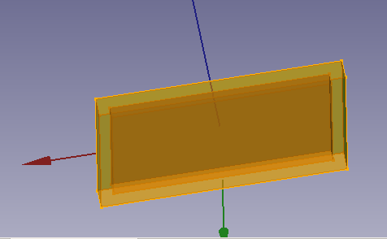

## Create the grid mould with the hollow boxe

Copy the hole box and make it higher.
Create an array of hexagons*, large enough to overlap the copy of the hole box, and center it. Create an intersection boollean form.

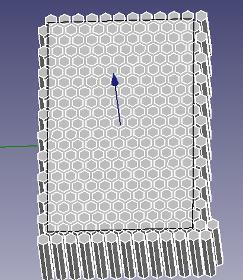

Apply this mould with a substraction operation to the hollow box.

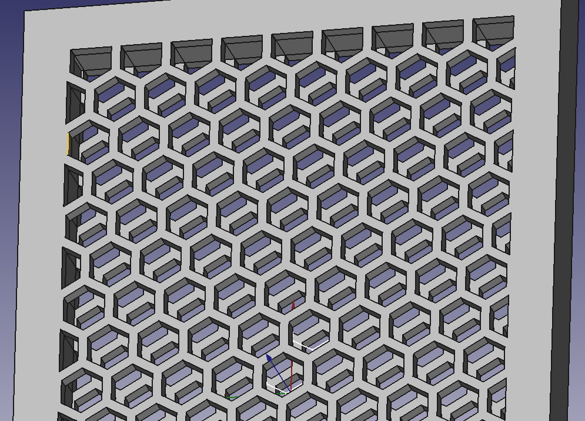

* A very interesting tutorial to build an array of hexagons can be found [here](https://www.instructables.com/Advanced-Hexagonal-Mesh-in-Freecad/).

## Create a mould of the wall insert and substract to the uncut fiaal box

Copy the initial box and the hollow box, make them the thickness of the wall, move them up a little bit.

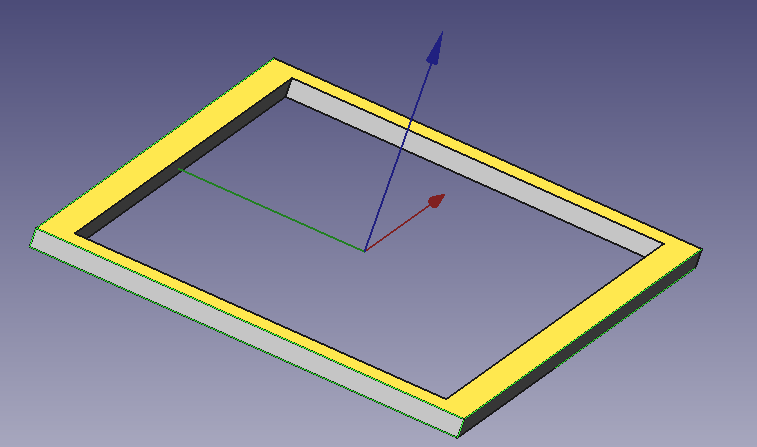

Substract them to create a frame. Substract this to uncut final box.

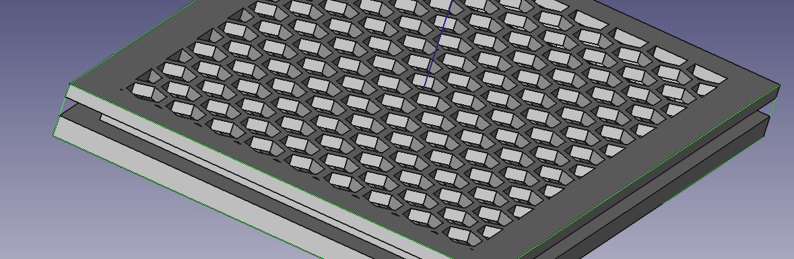

## Use a plan section of the narrow path to create inserts (male and female) that will fit the two parts (up and down) together

Use this tool 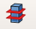 :

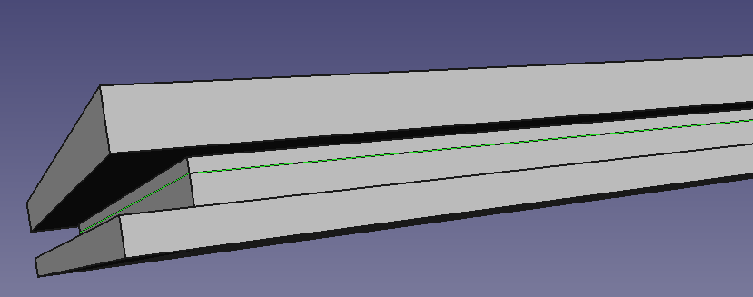

This insert should be different for the male and the female part : the male part must be slightly thinner than the female part, to let them fit smoothly.

From the frame plan, create an offset (0.2 mm)  and fill it

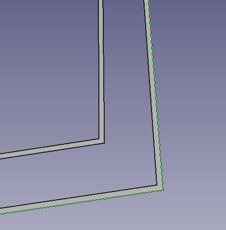

From the plan and the offset objects, extrude them and substract the offset solid from the plan solid :

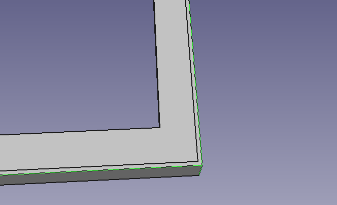

Now there are two frames : male slot and female slot (larger).

Substract the female one with the female part, and add the male slot to the male part.

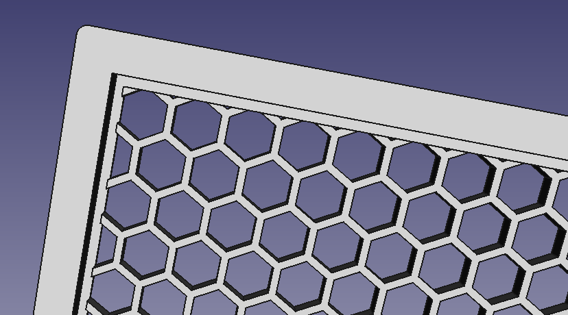

## Add a small hole on each inbound wall of the female part

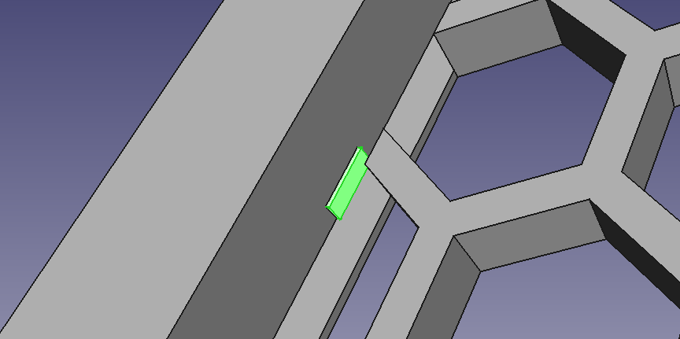

Copy these void boxes to make the male counterpart.

### Slice the boxes (with 45° plan), keep the part alongside the male part, round its edges and lift them a bit

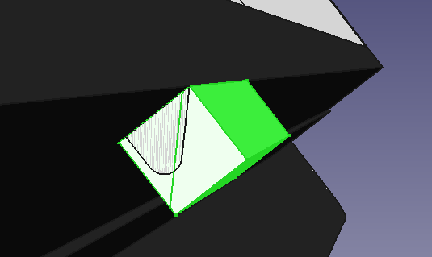

Join the male slots with the male part.

Evntually, round both parts squares for easing the printing.

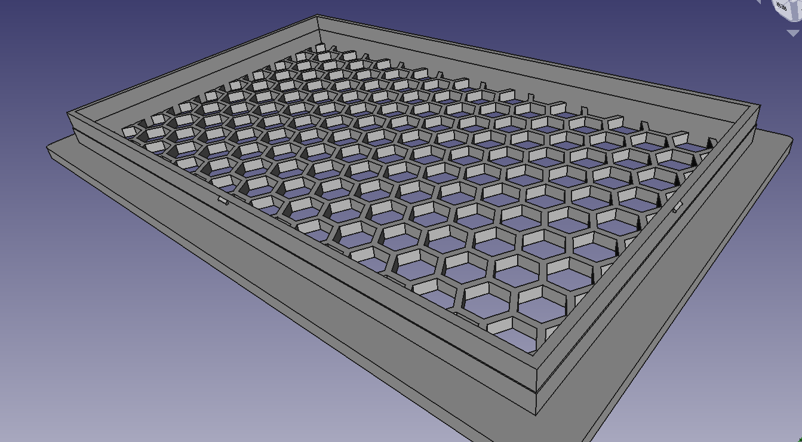

Male part

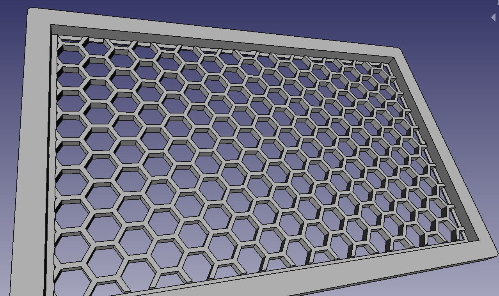

Female part
