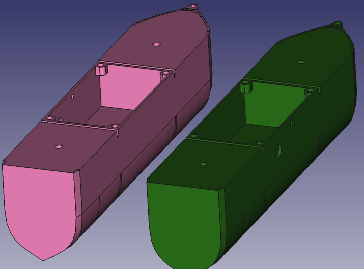
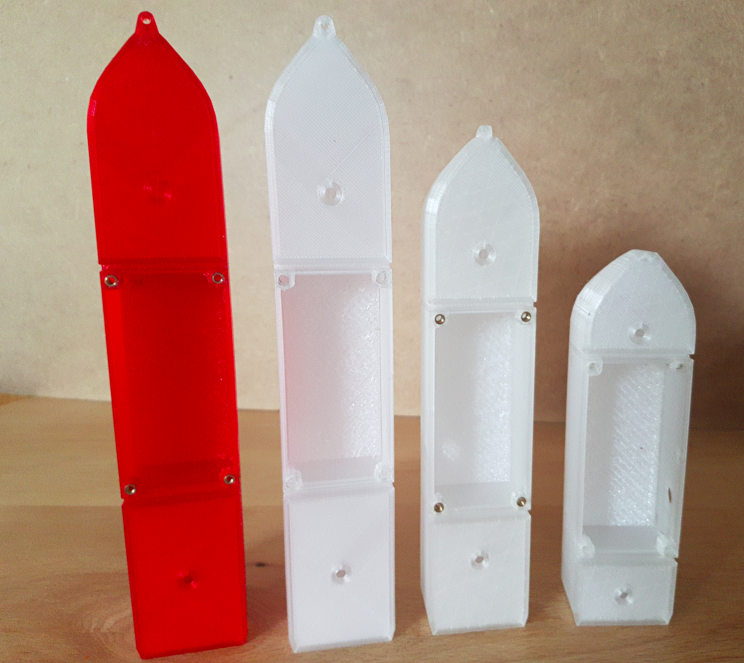

# Bateaux télécommandés : de la conception à la réalisation

## Introduction

Pour la fête d'école de mon fils, j'avais envie d'animer une activité ludique qui faisait appel à ce que l'on peut monter au fablab, comme les voitures télécommandées qui avaient été utilisées pendant la fête de la Science à Saint Malo en 2019(?).

_photo voiture_

L'idée des bateaux radiocommandés s'est imposée assez vite par rapport aux voitures:
* une vitesse réduite sur l'eau = pas de risque de casse
* moins de frottements (eau vs route) = moins de puissance nécessaire pour faire tourner les moteurs
* une zone de jeux (piscine) facile à monter/démonter
* et puis il y a plein de petits jeux que l'on peut organiser (parcours, jeux de balles...)

Les enfants étant trop jeunes (3-5 ans) pour participer au montage, on sollicite plutôt leur coordination entre l'action avec la télécommande et la réaction du mouvement du bateau. Pour cela les bateaux doivent être sufisemment simple à prendre en (petite) main.

Pour faire évoluer 4 à 5 bateaux dans la piscine, il faut un modèle facilement reproductible et évolutif. La meilleure solution est une structure (coque, pont, hélice) imprimée en 3D. La partie électronique reprend pour une large part le schéma des voitures, avec un microcontrolleur Arduino et un module NRF pour commander les moteurs.

En faisant des recherches sur les bases de modèles 3D ([thingiverse.com](https://www.thingiverse.com), [cults3D.com](https://www.cults3D.com)), j'ai trouvé beaucoup de modèles de bateaux RC, souvent orienté radiomodélisme, c'est à dire assez grands, destinés à la vitesse, surement assez technique à faire manoeuvrer. Plutôt qu'essayer d'adapter un modèle existant, autant partir d'une feuille blanche et construire le sien.


<center>examples de bateaux RC sur thingiverse.com</center>

## Orientations du design

Sans connaissance particulière en architecture navale, la tâche pour dessiner dans les temps une coque 1- qui flotte, 2- qui reste stable avec le matériel électronique à bord, s'annonçait compliquée. Finalement l'idée d'un catamaran s'est rapidement imposée, car elle cochait toutes les cases : 

* deux coques **sur un plan d'eau calme** sont plus stables qu'une seule
* la plateforme/cabine est assez vaste pour accueillir batteries et cartes électroniques
* cette même plateforme au dessus de la ligne de flottaison garantit que l'électronique ne soit pas en contact direct avec l'eau
* il est possible de séparer l'ensemble en pièces plus petites, plus rapidement imprimables en 3D

Pour la propulsion et la direction, je voulais éviter une hélice sous la/les coque(s), l'eau finit toujours par rentrer par le tube de propulsion, et le système de gouvernail utilise normalement un servo moteur.
J'avais en tête d'utiliser les moteurs DC 6-12V que l'on a au fablab:

 


En reprenant le concept des voitures du fablab, le moyen le plus simple est de placer un moteur dans chaque coque, et de les connecter à une roue à aubes, qui seront commandés chacune par un joystick (vers l'avant : moteur marche avant, vers l'arrière : moteur marche arrière).

## Prototypage

### FreeCAD

FreeCAD est un outil logiciel Open Source de conception de modèle en 3D. Toutes les pièces du bateau ont été conçues avec FreeCAD.

5 prototypes de catamaran sont nécessaires pour trouver le bon compromis entre taille/poids et flottabilité.
La coque est conçue par assemblage de coupes transversales pour former (vaguement) une forme de coque de bateau. Avec le poids à supporter, il a fallu élargir et allonger la coque de plusieurs centimètres.




Un support pour le moteur et le trou pour y insérer l'axe de rotation est placé de façon à qu'il soit plus d'un centimètre au dessus de la ligne de flottaison.

A l'avant et à l'arrière du compartiment moteur, le volume sert de réserve de flottabilité et seul un trou au niveau du pont est dessiné pour y accéder. Il y est possible de lester la coque, mais ça ne s'est pas révélé nécessaire.

La plateforme est d'un seul tenant et la largeur est calculé pour recevoir au plus juste les batteries et électronique.


Elle est fixée aux coques par 8 écrous nylon (ça ne rouille pas!) vissés dans des inserts laitons.

2 passages de cables pour l'alimentation des moteurs sont ajoutés et cachés dans la structure de la plateforme.


Les roues à aubes doivent être suffisemment écartées des coques pour projeter le moins d'eau sur la plateforme et dans les coques. La liaison coque pont ne doit son étanchéité qu'au serrage des vis (un trou a été ajouté pour vider l'eau si besoin).


roue à aubes


<center>éclaté des pièces</center>



<center>les différents prototypes. A droite la première version, qui flottait difficilement avec un peu de poids dessus </center>

### Electronique

_"Faire compact et économique"_ c'est la devise à garder en tête! Autour d'un clone Arduino Nano, un module NRF 2.4GHz (très bon tuto sur [passionelectronique](https://passionelectronique.fr/tutorial-nrf24l01/)) branché en SPI au microcontroleur, 2 moteurs 9 V, un CI L293D pour commander les moteurs.

Pour la consommation, les 2 moteurs peuvent être assez gourmands, d'où l'ajout d'une batterie 9V dédiée. Le circuit 5V (arduino et composants actifs) sont alimentés avec deux piles AAA en série. Un régulateur linéaire DC-DC est nécessaire pour garantir les 5V sur l'entrée non régulée de l'Arduino.


Coté télécommande, on retrouve également un Arduino + un module RF, 2 joysticks et 2 piles AAA avec un régulateur pour tout alimenter.


<center>shéma du circuit bateau</center>


<center>Circuit commande (gauche) et bateau (droite)</center>

### Code Arduino

Le programme de la télécommande doit servir à une chose : transmettre par radio (en utilisant la librairie RF24) l'information sur l'état des joysticks. Seul le signal de la composante verticale des joysticks est utilisé (Vy), et pour chacun d'entre eux, un seuil haut et bas est défini pour déterminer le déclenchement du mouvement du moteur.

Valeur comprise entre|signal envoyé|mouvement du moteur
---|---|--
0 et 249|0|arrière
250 et 799|1|arrêt
800 et 1023|2|avant

Pour chaque joystick, l'arduino reçoit un signal analogique. La valeur reçue est comprise en 0 et 1023 (convertisseur analogique numérique sur 10 bits).

Dès que l'un des signal change de plage, un nouveau signal est envoyé par le module RF. Chaque valeur (0-1-2) est transformé en demi-byte (sur 4 bits) et associé en 1 seul byte pour être envoyé

Exemples:

signal gauche|signal droit|byte envoyé
--|--|--
0000 (0)|0000 (0)|00000000
0001 (1)|0000 (0)|00010000
0010 (2)|0001 (1)|00100001
...|...|...

Le byte est décodé par le récepteur et le microcontroleur commande les moteurs via le CI L293D. Pour chaque moteur, une sortie controle la puissance (en PWM), et deux pins controlent le sens de rotation.

Le code est identique pour chaque bateau. Pour éviter les interférences entre eux, il faut juste changer le canal de transmission (120 possibilités) ("channel configuration").

```arduino
#include <Arduino.h>
#include <RF24.h>

/* channels configuration :
*  white  100
*  blue   102
*  green  104
*  red    106
*  yellow 108
*/
#define channel 108

#define pinCSN 9
#define pinCE 10
RF24 radio(pinCE,pinCSN);


#define leftControlGPIO 1
#define rightControlGPIO 2

byte dataSent;
byte leftOut, rightOut, last_leftOut, last_rightOut = 0;
int leftIn, rightIn = 0;
int max = 800;
int min = 250;
String str = "";

void setup() {
  Serial.begin(9600);
  Serial.println("Hello Controller!");

  pinMode(leftControlGPIO,INPUT);
  pinMode(rightControlGPIO,INPUT);

  radio.begin();

  radio.setChannel(channel);
  radio.setPALevel(RF24_PA_MIN);
  radio.setDataRate(RF24_1MBPS);

  radio.openWritingPipe(10101);

  radio.stopListening();

}

void loop() {
  delay(100);
  leftIn = analogRead(leftControlGPIO);
  rightIn = analogRead(rightControlGPIO);
  //Serial.println(str+"raw left value : " + leftIn +" , raw right value : " + rightIn);

  if (leftIn > max) {
    leftOut = byte(2); // forwards
  } else if (leftIn > min)
  {
    leftOut = byte(1); // stand by
  } else
  {
    leftOut = byte(0); // backwards
  }

  if (rightIn > max) {
    rightOut = byte(0);
  } else if (rightIn > min) // forwards
  {
    rightOut = byte(1); // stand by
  } else
  {
    rightOut = byte(2); // backwards
  }

  if ((rightOut != last_rightOut) || (leftOut != last_leftOut)) {
    Serial.println(str+"To send => left value : " + leftOut +" , right value : " + rightOut);
    // structure of byte dataSent : (left signal) 0000-0000 (right signal)
    dataSent = rightOut | (leftOut << 4);
    radio.write(&dataSent,sizeof(dataSent));
    //Serial.println(dataSent,BIN);

    last_leftOut  = leftOut;
    last_rightOut = rightOut;
  }
}
```

Pas besoin pour les moteurs d'être à pleine puissance, la moitié (120/255) est suffisant pour faire bouger les bateaux dans une piscine.

```arduino
#include <Arduino.h>
#include <RF24.h>

/* channels configuration :
*  white  100
*  blue   102
*  green  104
*  red    106
*  yellow 108
*/
#define channel 108
#define motorPower 120 // 0-255 full scale

#define pinCE 8
#define pinCSN 7

// port motor
#define pinEN12 3
#define pinIN1 2
#define pinIN2 4

// starboard motor
#define pinEN34 5
#define pinIN3 6
#define pinIN4 9

RF24 radio(pinCE,pinCSN);

byte dataReceived;
int leftSignal, rightSignal;

String str ="";

void setup() {
  Serial.begin(9600);
  Serial.println("Hello Boat!");
  
  pinMode(pinEN12,OUTPUT);
  pinMode(pinIN1,OUTPUT);
  pinMode(pinIN2,OUTPUT);

  pinMode(pinEN34,OUTPUT);
  pinMode(pinIN3,OUTPUT);
  pinMode(pinIN4,OUTPUT);

  digitalWrite(pinIN1,LOW);
  digitalWrite(pinIN2,LOW);    
  
  radio.begin();

  radio.setChannel(channel);
  radio.setPALevel(RF24_PA_MIN);
  radio.setDataRate(RF24_1MBPS);

  radio.openReadingPipe(0,10101);

  radio.startListening();
}

void loop() {
  if (radio.available()) {
    radio.read(&dataReceived,sizeof(dataReceived));
    //Serial.print("Message reçu : ");
    Serial.println(dataReceived,BIN);
    leftSignal = dataReceived >> 4;
    rightSignal = dataReceived & byte(15);
    //Serial.println(str+"LeftSignal : "+leftSignal+", rightSignal : "+rightSignal);
    
    switch (leftSignal)
    {
    case 0: // backwards
      digitalWrite(pinIN1,HIGH);
      digitalWrite(pinIN2,LOW);
      analogWrite(pinEN12,motorPower);
      break;
    case 1: // stand by
      digitalWrite(pinIN1,LOW);
      digitalWrite(pinIN2,LOW);
      analogWrite(pinEN12,0);
      break;
    case 2: // forwards
      digitalWrite(pinIN1,LOW);
      digitalWrite(pinIN2,HIGH);
      analogWrite(pinEN12,motorPower);
      break;
    default:
      break;
    }
    switch (rightSignal)
    {
    case 0: // backwards
      digitalWrite(pinIN3,HIGH);
      digitalWrite(pinIN4,LOW);
      analogWrite(pinEN34,motorPower);
      break;
    case 1: // stand by
      digitalWrite(pinIN3,LOW);
      digitalWrite(pinIN4,LOW);
      analogWrite(pinEN34,0);
      break;
    case 2: // forwards
      digitalWrite(pinIN3,LOW);
      digitalWrite(pinIN4,HIGH);
      analogWrite(pinEN34,motorPower);
      default:
      break;
    }
  }
}
```

### Premiers tests

Les roues étaient trop proches des coques, de l'eau s'infiltrait à l'intérieur. Le bateau était clairement trop enfoncé. L'électronique a bien fonctionné pendant une heure. Les batteries s'épuisaient à ce moment et de la condensation sur la carte arduino a pu être à l'origine de perte de commande. A moins que ce soit le montage sur la carte PCB de prototype, un court circuit ou une mauvaise soudure...


Avec un capot sur la plateforme pour protéger l'électronique et des coques plus profondes, les problèmes rencontrés lors du test seront résolus.

## Production en série

### Commande de PCB

Pour m'assurer que le montage électronique sera fiable sur tous les modèles, et pour m'épargner de longues heures de soudures, je suis passé par un fabricant de prototype de PCB. Le principe : 

1. avec un logiciel de prototypage (ici __Kicad__), on dessine le shéma du circuit, puis on l'exporte vers le module PCB. Chaque composant du circuit a une __empreinte__ qui fournit l'espace et les connecteurs qu'il prend comme objet réel
2. Dans le module PCB, on configure la taille de la carte, le placement des composants, le chemin des connections sur leur couche...
3. le fichier PCB (ex. format gerber) est envoyé à une société qui se charge de réaliser la PCB. Je suis passé par le site [jlcpcb.com](https://jlcpcb.com), mais beaucoup d'autres fabriquants chinois existent.

Les cartes arrivent au bout de 10-15 jours (30 jours pour ma part), il reste alors à souder les composants dessus. Pour garantir un changement facile de composant s'il venait à être HS, j'ai soudé des connecteurs et sockets direectement sur la carte. Le composant est juste inséré et peut être enlevé très facilement.


empreinte du composant L293D


plan du PCB avant envoi pour production (Kicad PCB)


socket pour composant DIP


carte PCB de chez JLCPCB

### Montage


<center>Pièces pour bateau avant assemblage</center>


<center>Pièces pour télécommande avant assemblage</center>

La télécommande est dans une boite de carton recyclé. Pas trop grande pour avoir être mis dans les mains des enfants.

## Fête de l'école


## Retours et améliorations

Ce projet a été pour moi l'occasion d'animer un stand avec les enfants à partir d'une idée originale. De la conception à la réalisation, j'ai toujours eu en tête à faire quelque chose de simple à reproduire, simple à utiliser, et de solide. De plus, le montage des pièces et de la carte ne prend que quelques heures.
Les enfants ont tous compris comment déplacer le bateau, et très peu ont arreté de jouer avant la fin de leur tour. Des balles flottaient à la surface et l'un des jeux consistait à essayer d'attraper une balle entre les coques et de l'amener au milieu de la piscine pour la faire tomber dans un seau. Rétrospectivement, un jeu collectif avec les balles (type football ou basket avec 2 équipes, ou un jeu de tri de couleurs) aurait mis plus d'ambiance.
Question fiabilité, les bateaux ont tourné pendant la durée de l'animation sans problème majeur. Un bateau ne répondait plu complétement aux commandes envoyées mais cela était probablement du aux batteries qui s'épuisaient. Aprsè coup, aucune trace d'oxydation n'était visible sur la carte (contrairement au prototype). Une télécommande est tombée à l'eau mais elle a continué à fonctionner, même avec le carton mouillé.

Les bateaux pourront être réutilisés pour une prochaine fête d'école. J'ai pu constaté que l'on arrive à jouer avec dès 3 ans avec de l'aide. Et les adultes peuvent aussi être de la partie.
Pour un public jeune plus agé, le montage et/ou le codage peut être aussi le moment d'apprendre l'électronique et la physique. La carte PCB peut recevoir un servo moteur et un capteur analogique. Il est alors possible de l'utiliser pour un robot sur roue par exemple.

### Liste complète des composants et cout approximatif

Pour la télécommande : 

pièce|quantité|coût (03/2022)
--|--|--
Arduino nano|1|6.8€
Module NRF24L01|1|1.83€
Joystick axe XY|2|2€
Régulateur de tension|1|0.75€
Boitier 2 piles AAA|1|0.65€
Condensateur électrolytique 10µF|1|~0€
Interrupteur SPST|1|0.15€
Entretoise M2x10mm|8|~0€
Ecrou M2|12|~0€
Fils Dupont femelle||~0€
Boite en carton|1|0€

Pour le bateau : 

pièce|quantité|coût (03/2022)
--|--|--
Arduino nano|1|6.8€
Module NRF24L01|1|1.83€
Régulateur de tension|1|0.75€
Driver L293D|1|0.8€
Boitier 2 piles AAA|1|0.65€
Prise pile 9V|1|0.15€
Interrupteur DPDT|1|0.37€
Condensateur électrolytique|1|~0€
Moteur DC 9V|2|3.06€
Prise male femelle PHx2 2mm|4|~0€
Connecteurs pin femelle et males 2.54mm||~0€
PCB|1|1.2€
Socket DIP16|1|0.1€
Vis Nylon M3|8|~0€
Inserts laiton 4.2mm diam M3|4|~0€
Vis M2 autotaraudeuse|2|~0€
Ecrou M2|2|~0€
PLA|<100g|~2€
PETG translucid|~225g|~5€

L'augmentation récente (04/2022) des prix des composants a fait grimper le prix total. Et cela ne prend pas en compte les essais d'impression, les composants qui ont grillés, les outils (soudure, imprimante 3D,...) ni le temps passé (notamment sur les logiciels).

### Fichiers sources (à venir)

cf thingiverse (stl)

cf github (code et schéma)

