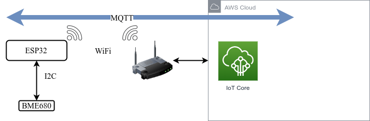

# ESP32+BME680 connected to AWS IoT

>Small project as a proof of concept for cloud based solutions of IoT communication and data presentation (with a web client).

## Objectives

- First:
  1. Connect via SSL an ESP32 to AWS IoT Core service via MQTT. **TSL, MQTT**
  2. Publish structured and timed sensor data (BME680) through MQTT. **JSON, NTP**
  3. Create a client site to serve real time and stored data. **AWS Lambda, AWS Amplify, AWS DynamoDB or TimeStream**

- _...Then_ :
  - Device side
     1. Improve autonomy: battery mounting, energy saving __Deep Sleep__
     2. Portability: Choose and change network __WiFi Manager__



## Tools and hardware

1. ESP32 WROOM-32
2. Pimoroni BME680 sensor
3. an AWS account

## Useful guidelines & links

[Amz blog - ESP32 with AWS IoT](https://aws.amazon.com/fr/blogs/compute/building-an-aws-iot-core-device-using-aws-serverless-and-an-esp32/)

## Code

[Github repository](tocome)

### Libraries used

[Bosch BSEC Arduino](https://github.com/BoschSensortec/BSEC-Arduino-library?utm_source=platformio&utm_medium=piohome) High level configurable library. Presents _virtual sensors_  at predictive intervals (raw & computed temp, raw and computed humidity, air quality index, air quality ohm value, fiability index)

[MQTT by  J.Gaehwiler](https://github.com/256dpi/arduino-mqtt)

~~[Async-Mqtt-Client](http://marvinroger.viewdocs.io/async-mqtt-client/2.-API-reference/) : Librairie qui permet de d'appeler des callbacks lors des évènements du client Mqtt (connect, disconnect, subcribe, message arrivé...)~~ seems not to be working with WiFiScure client

[ArduinoJSON by B. Blanchon](https://arduinojson.org/)

## Establish a secured connection between the device and AWS IoT Core

### 1. Create a AWS IoT object with its certificates

First, we need to configure the service AWS IoT :

<!-- tabs:start -->

#### __Object creation__

Choose a name for the device :


#### __Certificates__

Download 3 certificates & key. We need the Root CA 1 from Amazon, the CRT certificate of the object and the private key.
Certificates are associated to at least an object and a strategy.

!> Once created and downloaded, keys (private, public) are no more reachable.


#### __Strategy Policy__

Declare authorizations the certificate holder can get while connecting to the AWS service. It is a JSON file, versioning enabled by AWS. [Examples](https://docs.aws.amazon.com/iot/latest/developerguide/connect-policy.html) of strategy policies.

We can set a non restrictive plocy for testing purposes :

```json
{
  "Version": "2012-10-17",
  "Statement": [
    {
      "Effect": "Allow",
      "Action": "iot:*",
      "Resource": "*"
    }
  ]
}
```

It is good practice to restrict policy to only devices and messages used, like :

```json
{
  "Version": "2012-10-17",
  "Statement": [
    {
      "Effect": "Allow",
      "Action": "iot:Connect",
      "Resource": "arn:aws:iot:eu-central-1:xxxxxxxxxxx:client/WeatherStation_01"
    },
    {
      "Effect": "Allow",
      "Action": "iot:Publish",
      "Resource": "arn:aws:iot:eu-central-1:xxxxxxxxxxx:topic/weatherstation/pub"
    },
    {
      "Effect": "Allow",
      "Action": "iot:Receive",
      "Resource": "arn:aws:iot:eu-central-1:xxxxxxxxxxx:topic/weatherstation/sub"
    },
    {
      "Effect": "Allow",
      "Action": "iot:Subscribe",
      "Resource": "arn:aws:iot:eu-central-1:xxxxxxxxxxx:topicfilter/weatherstation/sub"
    }
  ]
}
```


<!-- tabs:end -->

### 2. Load test code

#### PlatformIO 

I used the platformIO plugin for VS code for the first time. PlatformIO allows more platform support thant just Arduino, with plenty of librairies availables. Dependencies are _project related_, not platform related (like Arduino IDE).
Combined with VS code, Arduino (or others) programming are much facilitated thanks to Git versioning, autocompletion.

On top of each project lies the [platform.ini](https://docs.platformio.org/en/latest/projectconf/) file : 

#### Code


### 3. Check pub/sub messages

## Structure and publish data from sensor

## Create a simple web client

[guide Markdown](https://guides.github.com/features/mastering-markdown/#intro)

[quick start docsify](https://docsify.js.org/#/quickstart)

[tuto docsify](https://michaelcurrin.github.io/docsify-js-tutorial/#/?id=docsify-basics)
