# Deploy a web application on AWS ECS using Docker and Django

In order to manage my electronics spare (capacitors, sensors, switch..) stock I would need a program that can tell me what kind of components I have, their specification, how many I get and at what price. For my DIY/Arduino projects, it would be nice if I could find in a database if the components can suit the requirements. Because my stock keeps growing faster than my projects empties it (buy before, ask what for later!), I can't remember exactly what's left in my boxes.

So why not publishing a small web site with a database, exposing simple use cases such as display the list, search a component, add and remove spare.

This nice small project can be a good opportunity to level up my learning skills in :

- Python, with __Django__
- CI/CD
- Cloud architecture, with __Amazon Web Service__
- Containers, with __Docker__, __AWS ECS__

There will be Doker images of the django application, the database, and a web server (NGINX). They are to be pushed on a AWS ECR (image registry) after testing and then pushed by ECS (Elastic Container Service) on EC2 instances.

The infrastructure is overrated for this kind of project (I would barely be the unique user), a standard _nodejs_ or _PHP_ on Amazon Lightsail or OVH webhosting would suffice.

Nonetheless, what matters here is about as much as publish a useful website than detail and understand the mechanisms of a modern deployement chain including cloud provider, Django framework, CI/CD Saas.

So let's go!

## Overall view

Here is an overall view of the project :

The idea is to move step by step:

1. Setup Django and its Docker image locally
2. Build and push DB and server images on the repository
3. Create and test the app with ECS
4. Describe a CI/CD deployement
5. Program : Use cases, models, logic
6. Develop, test and publish

## Prerequisites

- a AWS account
- a Github account
- Docker, Terraform, python3 installed on the computer

## Django on docker

### Install Django in a Docker image

Create a directory `stockweb_project` and `django` and create a python virtual environnement:

```bash
mkdir stockweb_project && cd stockweb_project
mkdir django && cd django
python -m venv venv
```

Create a `requirements.txt` for pip to install libraries and frameworks. Add `Django` in it:

```bash
touch requirements.txt
echo "Django>=3.0,<4.0" > requirements.txt
```

It is time to install __django__ with `pip`:

```bash
pip install -r requirements.txt
```

and create the base structure of a django project (named `djangoproject`...):

!> don't forget the trailing dot `.`

```bash
django-admin startproject djangoproject .
```

Create a `Dockerfile` for the Django application. Based on the official __Python__ image, the image will host the Django framework and copy the site code in the container directory :

```docker
# Use the official Python image from the Docker Hub
FROM python:3.8.2

# These two environment variables prevent __pycache__/ files.
ENV PYTHONUNBUFFERED 1
ENV PYTHONDONTWRITEBYTECODE 1

# Make a new directory to put our code in.
RUN mkdir /code

# Change the working directory. 
# Every command after this will be run from the /code directory.
WORKDIR /code

# Copy the requirements.txt file.
COPY ./requirements.txt /code/

# Upgrade pip
RUN pip install --upgrade pip

# Install the requirements.
RUN pip install -r requirements.txt

# Copy the rest of the code. 
COPY . /code/
```

!> Don't forget to add a `.dockerignore` file. It's like a `.gitignore`, it avoids the specified files or folders to be copied in the container. In a django project, ignore :
`venv/`, `Dockerfile`, `.gitignore`, `git`

Build this image and run it with the django `runserver` to expose:

```bash
docker build --tag djangoapp:0.0 .
```

```bash
docker run -p 8002:8000 djangoapp:0.0 python manage.py runserver 0.0.0.0:8000
```

In the browser, `http://localhost:8002` displays the generic Django webpage:

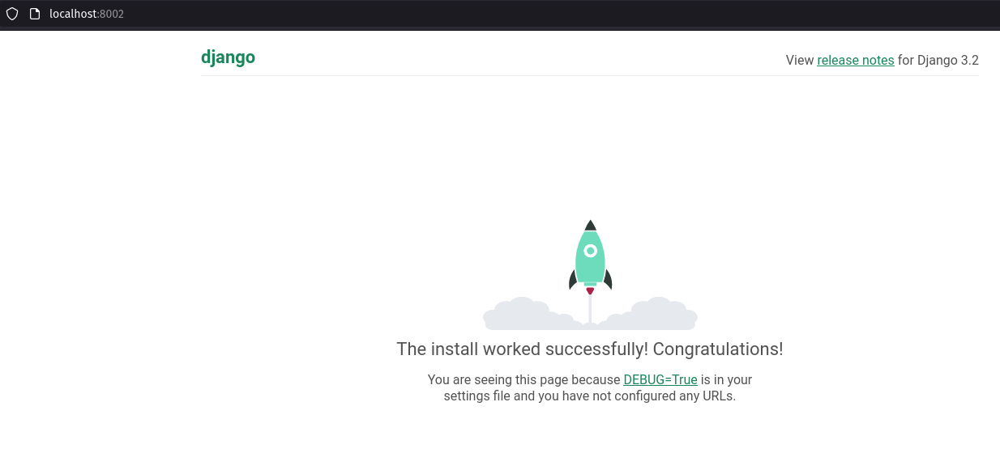

Next I create the django app which will host the views, models and routes to the website.

In `stockweb_project/django`, create the application `websiteapp`:

```bash
python manage.py startapp websiteapp
```

The project stucture should look like this:

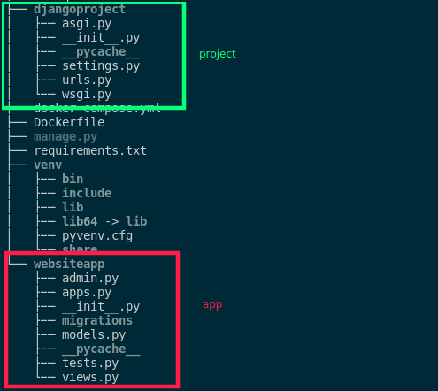

Let's try to add a new view. In `djangoproject/urls.py`, add a path to a `home` view (not created yet):

```python
from django.contrib import admin
from django.urls import path
from websiteapp.views import home

urlpatterns = [
    path('admin/', admin.site.urls),
    path('',home,name='home')
]
```

If path is left blank, `localhost:8000`  is redirected to this view (in `websiteapp/views.py`):

```python
from django.shortcuts import render
from django.http import HttpResponse
import datetime


# Create your views here.
def home(request):
    now = datetime.datetime.now()
    html = "<html><head>this is homepage</head><body><p>The current time is %s" %now.strftime("%H:%M:%S" )
    return HttpResponse(html)
```

The page should just display the current time. Before going to it, I need to build again the docker image. As almost steps are cached, it is done in a few seconds. It is partly because separating `COPY ./requirements.txt /code/` with the rest of the code `COPY . /code/` avoids to install again the requirements.

```bash
docker build --tag djangoapp:0.0 .
```

Once the image is launched again, refresh the web page :

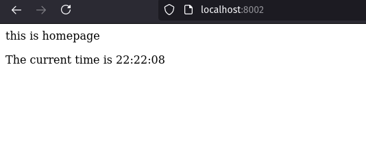

## Make Docker images up and running

There are 2 (or 3) additional images to run along the django container :

- the database container
- the server container

A _db admin_ service can also be up to inspect tables and data created in the webapp, though it should not be in production.

> I decided to use a __NoSQL__ database to manage my models for reasons :
>  
> - Spares types have various caracteristics, with a SQL database I would almost end up with as many tables as spare object. __NoSQL__ allows some flexibility in data models, with different keys (attributes) in the same collection,
> - I don't need to handle complex queries with JOIN and/or aggregation, data is mainly aimed at being flatly displayed on the webpage.

I eventually use the offical __mongoDB__ docker image and [__mongo-express__](https://hub.docker.com/_/mongo-express) image to expose a web based MongoDB admin tool.

A persistant data storage will host the data.

### docker-compose

But first, create a `docker-compose.yml` where all services will run all at once in the same network:

```yml
version: "3.9"
   
services:
  python:
    container_name: django
    build: ./
    env_file: 
      - db.env
    command: python manage.py runserver 0.0.0.0:8000
    ports:
      - "8000:8000"
    depends_on: 
      - db
  db:
    container_name: mongodb
    image: mongo:latest
    restart: always
    env_file: 
      - db.env
    ports: 
      - "27017:27017"
    volumes: 
      - mongo_data:/data/db
  mongo-admin:
    container_name: mongo-admin
    image: mongo-express:latest
    ports:
      - "8081:8081"
    env_file: 
      - db.env
    depends_on: 
      - db
volumes: 
  mongo_data:
```

`build: ./` : use the Dockerfile in the same directory

`env_file` : use a `.env` file. Put in name of db, host name, port...

`restart: always` : the container will restart if it is stopped manually or following a code 0 exit.

`volumes:` : specifiy a name for the persistant storage. To match the path where __MongoDB__ holds its data,it must be mounted to the container's `/data/db/` directory.

!> this volume definition must prevent `docker-compose` to create a new persistant volume each time `docker-compose up` is called. `docker-compose down` wil _not_ ersae volume, only if called with `-v` flag (`docker-compose down -v`). See [here](https://forums.docker.com/t/why-docker-compose-down-deletes-my-volume-how-to-define-volume-as-external/67433/2) to understand how `... down` can delete the volume.

To build images before starting containers : `docker-compose up --build`

### MongoDB settings

Before checking the web interfaces, we must modify some files:

1. Django doesn't natively manage NoSQL databases. Instead, the [__djongo__](https://www.djongomapper.com/) python package must be added in `requirements.txt`.

`settings.py`:

2. Add the app config in `INSTALLED_APPS` :

```python
INSTALLED_APPS = [
    'django.contrib.admin',
    'django.contrib.auth',
    'django.contrib.contenttypes',
    'django.contrib.sessions',
    'django.contrib.messages',
    'django.contrib.staticfiles',
    'websiteapp.apps.WebsiteappConfig'
]
```

3. Fill in `DATABASES` with environement variables :

```python
DATABASES = {
    'default': {
        'ENGINE': 'djongo',
        'NAME': os.getenv('DB_NAME'), 
        'CLIENT': {
            'host':  os.getenv('DB_HOST'),
            'port': os.getenv('DB_PORT'),
            'username': os.getenv('MONGO_INITDB_ROOT_USERNAME'),
            'password': os.getenv('MONGO_INITDB_ROOT_PASSWORD'),
        }
    }
}
```

`models.py`:

4. Add 2 models `Shop` and `Spare` (bases of the data model) with 2 text properties:

```python
# Create your models here.
class Shop(models.Model):
    name = models.CharField(max_length=100)
    website = models.CharField(max_length=100)

    def __str__(self):
        return self.name

class Spare(models.Model):
    type = models.CharField(max_length=50)
    reference = models.CharField(max_length=50)

    def __str__(self):
        return self.reference

```

`admin.py`:

To get access to these models in the _admin_ app, register it in `admin.py`

```python
from .models import Shop,Spare

# Register your models here.
admin.site.register(Shop)
admin.site.register(Spare)
```

5. make migrations at container startup. To apply models changes in the DB, _Django_ must apply migrations files and migrate them with these commands:

```bash
python manage.py makemigrations
python manage.py migrate

exec "$@"
```

Put this code in a file in the same directory, `entrypoint.sh`, that is called as a `ENTRYPOINT` in the django Dockerfile:

```docker

... 
COPY . /code/

ENTRYPOINT [ "/code/entrypoint.sh" ]
```

`exec "$@"` to let the executable receives hte UNIX signals1

At this point, we can run `docker-compose --build`. All three services should started.

Check `localhost:8000` for the app hompage:

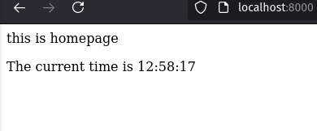

Check `localhost:8081` for mongo-express:

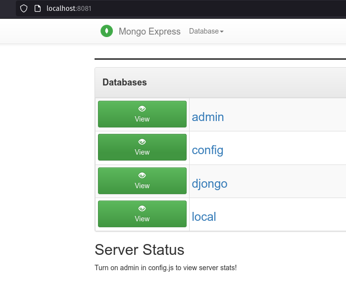

See the `djongo` databases : it holds all collections of the Django project's apps : auth, sessions, migrations... and 2 collections of the recently created models : Spare and Shop.

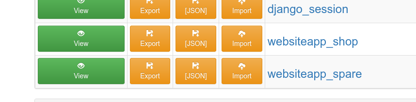

Check `localhost:8000/admin` for tha django admin dashboard:

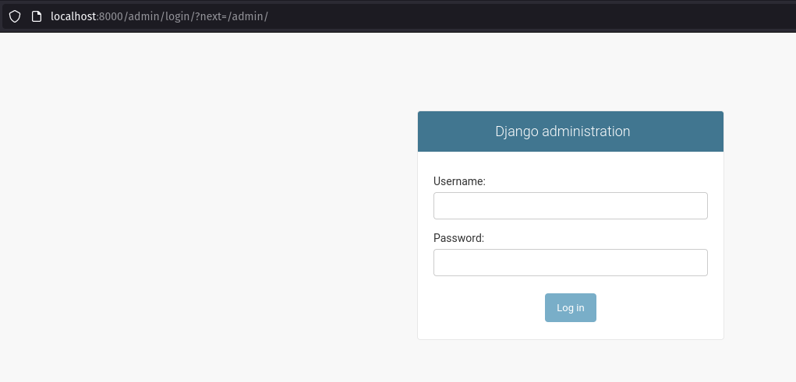

But we haven't created any user yet! To create an admin user (super right admin user), in the django container, run `python manage.py createsuperuser`:

```bash
docker exec -it django python manage.py createsuperuser`
```

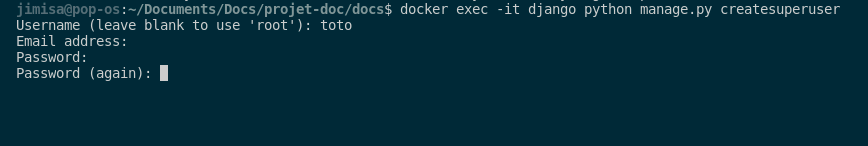

Now we have access to the admin dashboard, where we can create a documents in our collections:

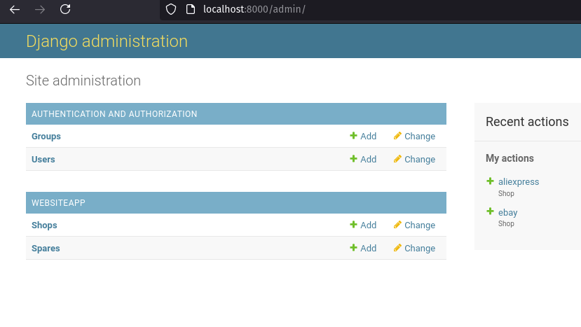

### NGINX server

To be ready to deploy on production, Django should be accessed from a dedicated server (not the built-in python server). NGINX is a common choice (or Apache) but it can't speak to the python framework, thus it needs an interface to communicate. It can be WSGI or ASGI (for asynchronous).
There is [`gunicorn`](https://docs.gunicorn.org/en/latest/install.html#). Add it in the `requirements.txt` file.

NGINX server needs to be configured with a `nginx.conf` file:

```nginx
upstream djangoapp {
    server django:8000;
}

server {
    listen 80;
    listen [::]:80;
    
    location / {
        proxy_pass http://djangoapp;
        proxy_set_header X-Forwarded-For $proxy_add_x_forwarded_for;
        proxy_set_header Host $host;
        proxy_redirect off;
    }

    location /static/ {
        alias /home/app/web/staticfiles/;
    }
}
```

TODO _explain conf file_

The NGINX service needs 2 volumes:

- the conf file folder mount to `etc/nginx/conf.d`
- the static file folder mounted to `home/app/web/staticfiles` container folder. This volume should be the same as the django's `staticfiles` directory where all static files (JS, CSS...) are to be collected

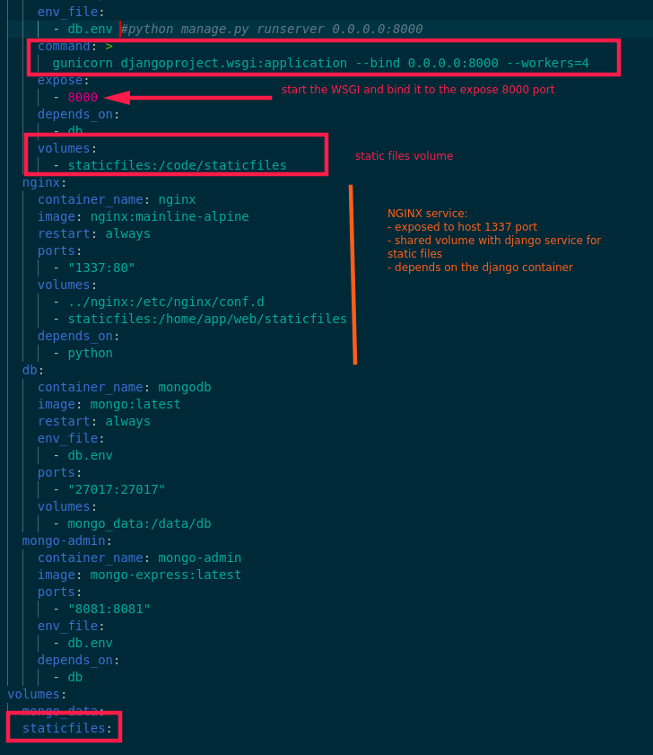

To collect static files, add a django task in `entrypoint.sh` :

```bash
python manage.py collectstatic --noinput
```

and in `settings.py`, we set up the path to the staticfiles directory :

```python
STATIC_ROOT = os.path.join(BASE_DIR,"staticfiles")
```

Build again and check on `localhost:1337/admin`, the admin app is served with static files collected :

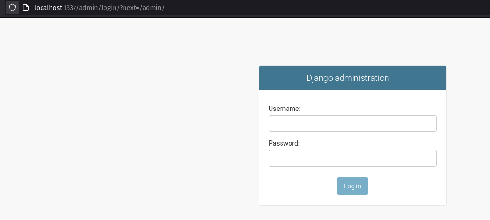

Thanks to __Tirth Jain__ for his [tutorial](https://blog.bitsacm.in/django-on-docker/) for this part.

## Build the AWS infrastructure

AWS provides lots of service to publish a web application. One of them, [__Elastic Container Service__](https://docs.aws.amazon.com/AmazonECS/latest/developerguide/Welcome.html) (ECS) manage containers on AWS infrastructure, scalling a cluster on EC2 instances or with AWS Fargate (serverless container runtime service).

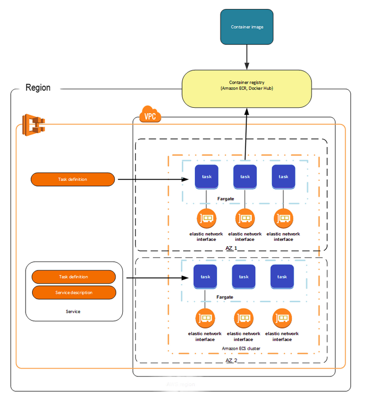

AWS ressources required | role
-|-
Cluster|Logical group of tasks or services (EC2 or Fargate)
Task definition|describes containers and parameters (network, volumes...) in JSON format
Service|definitions of how a task definition should run (numbers of simultanously tasks+load balancer used)
Task|a Docker container run based on its definition
Container instance| eq. to EC2 instance
Container agent| inside a container instance, it manages tasks life and send information to ECS

Before creating the service, it is good-pratice to get structure upon which ECS is built:

1. a VPC with 2 subnets
2. a Security Group
3. 3 Security Group Ingress (for ssh and container and public access)
4. a IAM role (to control access at the container instance, or give tasks a role)
5. an Elastic Load Balancer (Listener+ListenerRule+TargetGroup)
6. An Autoscaling Group

links : https://aws.amazon.com/fr/blogs/containers/developers-guide-to-using-amazon-efs-with-amazon-ecs-and-aws-fargate-part-3/

## CI/CD deployement

### What to test

TODO

### The pipeline

TODO

## The Code

### Use cases

TODO

### Models

TODO

### Logic

TODO

### Views

TODO

### Authentication

TODO

## Deployement in action

TODO
